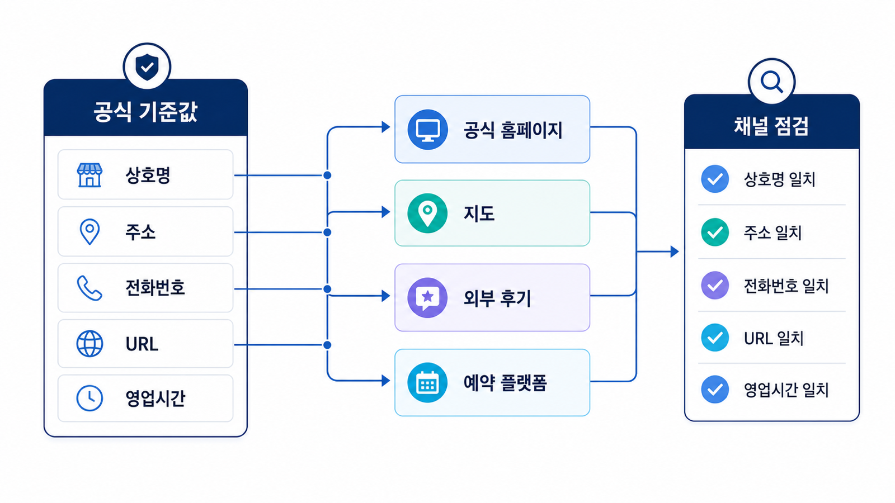

## NAP: 이름/주소/전화번호 일관성 점검


NAP는 Name, Address, Phone의 약자입니다. 한국어로는 상호명, 주소, 전화번호입니다. 로컬 SEO에서 NAP는 검색엔진과 지도 서비스가 여러 채널에 흩어진 정보를 같은 업체로 묶어 이해하게 만드는 기본 신호입니다.

병원/매장/학원처럼 방문 전환이 중요한 업종에서는 NAP가 조금만 어긋나도 문제가 생깁니다. `강남점`, `강남역점`, `서울강남점`이 섞이거나, 도로명주소와 지번주소가 채널마다 다르거나, 대표번호와 지점번호가 뒤섞이면 사용자는 물론 AI도 어느 지점을 말하는지 헷갈릴 수 있습니다.

[TOC]

## NAP가 흔들리는 대표 상황

| 상황 | 예시 | 생기는 문제 |
|---|---|---|
| 상호명 표기 차이 | ABC피부과 강남점 / ABC의원 강남역점 | 같은 지점인지 다른 지점인지 모호해진다 |
| 주소 표기 차이 | 도로명주소 / 지번주소 / 건물명 누락 | 지도와 홈페이지 정보가 어긋난다 |
| 전화번호 혼용 | 대표 콜센터 / 지점 직통 / 예약 전용 번호 | 전화 전환 측정과 지점 식별이 흐려진다 |
| 영업시간 불일치 | 홈페이지는 20시, 플레이스는 18시 | 방문 의사결정에서 이탈이 생긴다 |
| 폐업/이전 정보 잔존 | 예전 주소가 외부 디렉터리에 남음 | 오래된 정보가 AI 답변 근거로 남을 수 있다 |

## 점검 범위

NAP는 홈페이지 한 곳만 보면 안 됩니다. 최소한 다음 채널을 나눠 확인합니다.

| 채널 | 확인할 정보 | 우선 액션 |
|---|---|---|
| 공식 홈페이지 | 지점명, 주소, 전화번호, 영업시간, 예약 링크 | 지점별 페이지에 표준 표기 고정 |
| 네이버 플레이스 | 상호명, 카테고리, 주소, 전화, 영업시간, 사진 | 실제 방문 정보와 맞는지 확인 |
| Google Business Profile | 영문/국문 상호, 카테고리, 지도 위치, 영업시간 | 외국인/글로벌 검색까지 고려 |
| 카카오맵/Apple Maps | 위치, 전화, 길찾기, 운영 정보 | 모바일 길찾기 오류 방지 |
| 외부 디렉터리/후기 플랫폼 | 업체명, 의료진/강사/전문가명, 주소 | 오래된 지점/잘못된 표기 정리 |
| SNS/블로그/예약 플랫폼 | 프로필명, 링크, 전화, 예약 경로 | 사용자 이동 경로 일관화 |

## 지점형 업종의 표준 표기 만들기

여러 지점이 있는 경우 먼저 표준 표기표를 만듭니다. 이 표가 있어야 홈페이지, 지도, 리뷰 플랫폼, 콘텐츠, 광고 소재의 기준이 흔들리지 않습니다.

| 항목 | 표준값 | 금지/주의 표기 |
|---|---|---|
| 브랜드명 | 예: OO피부과 | OO클리닉, OO의원 혼용 금지 |
| 지점명 | 예: 강남역점 | 강남점/서울강남점 혼용 주의 |
| 주소 | 도로명주소 + 층/호수 | 건물명만 단독 표기 금지 |
| 전화번호 | 지점 직통 또는 대표 예약번호 | 채널별 임의 번호 혼용 금지 |
| 카테고리 | 대표 진료/서비스 카테고리 | 실제 제공하지 않는 카테고리 금지 |
| 예약 URL | 공식 예약/상담 페이지 | 오래된 이벤트 URL 사용 금지 |

## AI 답변에서 NAP가 중요한 이유

AI 답변은 사용자의 질문에 맞춰 여러 정보를 섞어 말합니다. 이때 `강남점은 야간 진료가 가능하다`, `홍대점은 주차가 어렵다`, `분당점은 특정 시술 후기가 많다`처럼 지점별 정보가 분리되어야 합니다.

NAP가 일관되면 AI가 브랜드와 지점을 안정적으로 식별할 가능성이 높아집니다. 반대로 정보가 섞이면 AI가 잘못된 주소, 오래된 전화번호, 다른 지점의 리뷰를 가져와 답변할 수 있습니다.

## NAP 점검 워크시트

| 지점 | 공식 표기 | 홈페이지 | 네이버 | 구글 | 카카오/Apple | 외부 후기 | 수정 필요 |
|---|---|---|---|---|---|---|---|
| 강남역점 |  |  |  |  |  |  |  |
| 분당점 |  |  |  |  |  |  |  |
| 홍대점 |  |  |  |  |  |  |  |

이 표는 한 번 만들고 끝내는 자료가 아닙니다. 이전, 휴무, 전화번호 변경, 예약 링크 변경, 지점명 변경이 있을 때마다 다시 확인해야 합니다.

## NAP 정규화 순서

NAP 점검은 눈으로 훑는 작업이 아니라 표준값을 정하고, 모든 채널을 그 표준값에 맞추는 작업입니다.

1. 공식 사업자 정보와 실제 방문 정보를 기준으로 `표준 상호명`, `표준 주소`, `표준 전화번호`를 정합니다.
2. 지점형 브랜드는 `브랜드명`, `지점명`, `서비스명`을 분리합니다. 예를 들어 `OO의원 강남역점`과 `보톡스 상담`을 같은 이름 칸에 섞지 않습니다.
3. 도로명주소를 기본값으로 쓰되, 건물명/층/호수/주차장 입구처럼 방문에 필요한 보조 정보를 별도 칸에 둡니다.
4. 대표번호, 지점 직통번호, 예약 전용번호를 구분합니다. 추적용 번호를 쓸 때도 사용자가 보는 대표 표기가 흔들리지 않게 합니다.
5. 폐업, 이전, 리브랜딩, 지점명 변경 이력이 있는 경우 예전 정보가 남아 있는 외부 페이지를 별도 목록으로 관리합니다.

| 항목 | 표준화 기준 | 실무 주의점 |
|---|---|---|
| 상호명 | 간판/사업자/지도 프로필에서 일관된 이름 | 키워드 추가를 위해 서비스명을 상호명에 억지로 붙이지 않는다 |
| 주소 | 도로명주소 + 층/호수 + 방문 보조 설명 | 지도 핀과 실제 입구가 다르면 사진/설명으로 보완한다 |
| 전화번호 | 사용자가 실제 연결되는 번호 | 채널마다 다른 번호를 쓰면 지점 식별과 전환 측정이 흔들린다 |
| 영업시간 | 평일/토요일/공휴일/점심시간/휴진일 | 지도 프로필과 예약 페이지 시간이 다르면 신뢰가 떨어진다 |
| URL | 지점 페이지 또는 예약 페이지 | 모든 지점을 대표 홈으로만 보내지 않는다 |

## LocalBusiness schema로 연결하기

NAP가 정리되면 홈페이지의 지점 페이지와 구조화 데이터도 같은 값을 써야 합니다. 아래는 개념을 이해하기 위한 단순 예시입니다. 실제 적용은 업종에 따라 `LocalBusiness`, `MedicalBusiness`, `Dentist`, `Store`, `Restaurant` 같은 하위 타입을 검토할 수 있습니다.

```json
{
  "@context": "https://schema.org",
  "@type": "LocalBusiness",
  "name": "OO피부과 강남역점",
  "address": {
    "@type": "PostalAddress",
    "streetAddress": "서울특별시 강남구 테헤란로 00, 5층",
    "addressLocality": "서울",
    "addressRegion": "강남구",
    "addressCountry": "KR"
  },
  "telephone": "+82-2-0000-0000",
  "url": "https://example.com/gangnam",
  "openingHoursSpecification": [{
    "@type": "OpeningHoursSpecification",
    "dayOfWeek": ["Monday", "Tuesday", "Wednesday", "Thursday", "Friday"],
    "opens": "10:00",
    "closes": "19:00"
  }]
}
```

중요한 것은 schema를 넣는 것 자체가 아니라 지도 프로필, 지점 페이지, 예약 페이지, 외부 디렉터리의 값이 같은 지점을 가리키는지입니다.

## 변경 이력 관리표

| 변경 상황 | 확인할 채널 | 완료 기준 |
|---|---|---|
| 지점 이전 | 홈페이지, 네이버, Google, 카카오, Apple, 예약 플랫폼, 외부 후기 | 예전 주소가 주요 채널에 남지 않음 |
| 전화번호 변경 | 지도 프로필, 광고 소재, 지점 페이지, SNS, 문자 안내 | 사용자가 보는 대표 번호가 일치 |
| 영업시간 변경 | 지도 프로필, 예약 시스템, 홈페이지, 소식/공지 | 공휴일/점심시간/야간 진료까지 반영 |
| 리브랜딩 | 상호명, 로고, 외부 프로필, 기사/디렉터리 | 예전 이름과 새 이름의 관계가 설명됨 |
| 지점 폐업/통합 | 지도, 검색 결과, 예약 URL, redirect | 폐업 지점으로 예약/방문 유도되지 않음 |


## NAP는 로컬 엔티티 식별 문제다

NAP는 단순한 연락처 표기가 아닙니다. 검색엔진과 지도 서비스가 `이 이름/주소/전화번호가 같은 업체 또는 같은 지점인가`를 판단하는 엔티티 식별 정보입니다. 이름 하나가 조금 다르거나, 주소 표기 방식이 채널마다 다르거나, 대표번호와 지점번호가 섞이면 신호가 분산됩니다.

| 흔한 불일치 | 예시 | 생기는 문제 | 정리 기준 |
|---|---|---|---|
| 상호명 차이 | 하록스의원 / 하록스 클리닉 강남점 | 같은 업체인지 판단이 흔들림 | 사업자/간판/공식 사이트 기준값 결정 |
| 주소 표기 차이 | 3층 / 301호 / 3F | 지도 좌표와 지점 식별이 흔들림 | 도로명주소+상세 호수 표준화 |
| 전화번호 차이 | 대표번호 / 예약번호 / 콜센터 | 지점별 전화 전환 측정이 어려움 | 용도별 번호를 명시하고 일관 사용 |
| URL 차이 | 홈페이지 / 블로그 / 예약 링크 | 공식 근거가 분산됨 | 지점 공식 URL과 예약 URL을 구분 |
| 영업시간 차이 | 홈페이지와 지도 시간이 다름 | 방문 전환 실패와 불신 발생 | 공휴일/점심시간/야간 진료 기준 관리 |

GEO 관점에서는 이 불일치가 더 위험합니다. AI가 여러 출처를 합쳐 답을 만들 때, 지점명과 주소가 엇갈리면 잘못된 위치, 잘못된 전화번호, 닫힌 시간대의 방문 안내가 답변에 섞일 수 있습니다.



<small>NAP 점검은 채널별 표기 차이를 줄이는 작업이 아니라, AI와 검색엔진이 같은 지점과 브랜드를 같은 엔티티로 식별하게 만드는 작업이다.</small>

## NAP 점검을 검색엔진 관점으로 확장하기

NAP 표준표를 만들었다면 다음 단계는 `어디에 같은 정보가 퍼져 있는가`를 확인하는 것입니다. 로컬 SEO에서는 이를 citation 또는 local citation 관리로 봅니다. 한국 실무에서는 지도/플레이스, 포털 프로필, 지역 디렉터리, 협회/전문 플랫폼, 언론 기사, 블로그 소개글까지 넓게 봅니다.

| 채널 | 확인할 항목 | 우선순위 |
|---|---|---|
| 공식 홈페이지 | 상호명, 지점명, 주소, 전화, 영업시간, 예약 URL | 최상 |
| 네이버 플레이스 | 카테고리, 주소, 전화, 진료/영업시간, 사진, 공지 | 최상 |
| Google Business Profile | 이름, 카테고리, 위치, 영업시간, 서비스, 웹사이트 | 높음 |
| 카카오맵/Apple Maps | 위치, 전화, 운영시간, 길찾기 정보 | 높음 |
| 협회/전문 플랫폼 | 전문가명, 자격, 소속, 주소, 전화 | 업종별 높음 |
| 언론/지역 매체 | 지점명, 위치, 대표 서비스 | 보조 |
| 블로그/커뮤니티 | 오래된 주소, 이전 지점 정보 | 정리 대상 |

## 지점형 브랜드의 NAP 거버넌스

여러 지점이 있는 병원/학원/프랜차이즈는 NAP를 한 번 정리하는 것으로 끝나지 않습니다. 신규 지점 오픈, 이전, 폐점, 전화번호 변경, 야간 진료 변경, 예약 링크 변경이 생길 때마다 검색 신호가 흔들릴 수 있습니다.

| 상황 | 해야 할 일 | 기록 위치 |
|---|---|---|
| 신규 지점 오픈 | 지점명/주소/전화/URL/카테고리 기준값 확정 | NAP 마스터 표 |
| 지점 이전 | 이전 주소 노출 채널 삭제/수정, 지도 좌표 재확인 | 변경 이력표 |
| 전화번호 변경 | 대표번호/예약번호/광고 번호 구분 | 번호 관리표 |
| 영업시간 변경 | 공식 사이트와 지도 채널 동시 수정 | 운영 캘린더 |
| 폐점/통합 | 폐점 안내, 리디렉션, 지도 상태 정리 | 폐점 체크리스트 |

운영 기준은 단순합니다. `공식 홈페이지의 지점 페이지`를 기준값으로 삼고, 지도/디렉터리/외부 프로필을 그 기준값에 맞춥니다. 이 순서가 있어야 AI 답변이 참조할 공식 근거도 명확해집니다.

## 참고 링크

로컬 비즈니스 정보의 구조화 관점은 Google의 [LocalBusiness structured data](https://developers.google.com/search/docs/appearance/structured-data/local-business)를 참고할 수 있습니다. 네이버 기반 노출은 [네이버 스마트플레이스](https://smartplace.naver.com/)에 등록된 정보가 중요합니다.

NAP 정리가 끝나면 [05-02 Entity와 브랜드 합의 신호](https://wikidocs.net/346351)를 함께 보면 좋습니다. 여러 채널이 같은 브랜드와 지점을 같은 의미로 가리키는 것이 엔터티 합의 신호의 출발점입니다. HaloX의 [GEO 콘텐츠 구조화 가이드](https://haloxlabs.ai/ko/blog/geo-content-structure)도 지점/서비스 페이지를 정리할 때 참고할 수 있습니다.

## 다음 흐름

다음 페이지에서는 NAP를 [네이버 플레이스, Google Business Profile, 지도 SEO](https://wikidocs.net/346609)에 어떻게 반영할지 봅니다.
