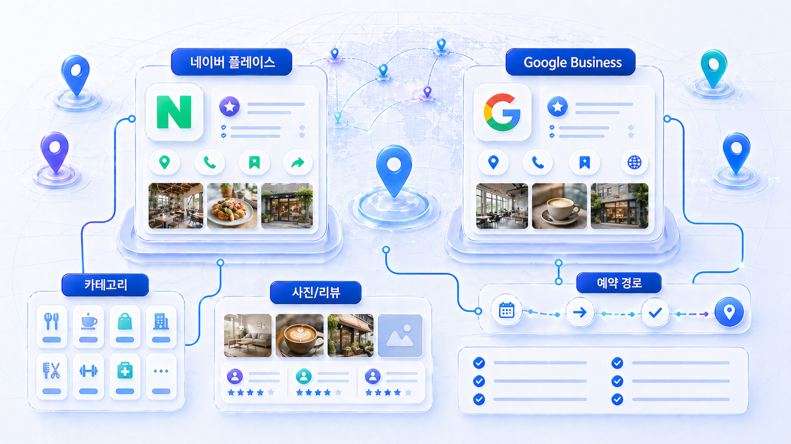
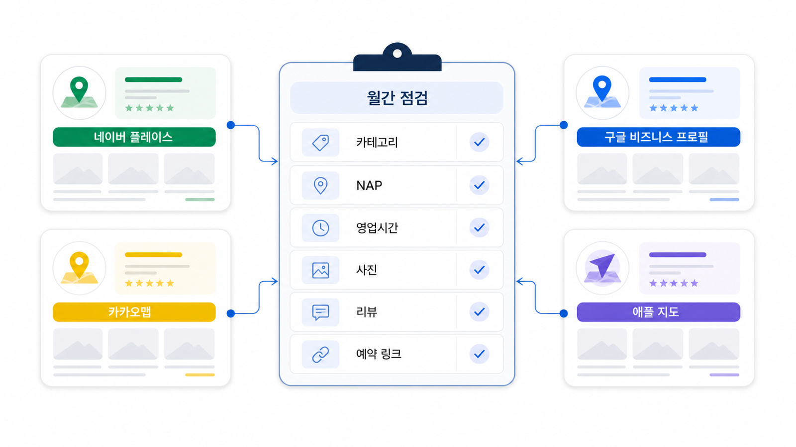

## 네이버 플레이스, Google Business Profile, 지도 SEO



지도 프로필은 로컬 비즈니스의 두 번째 홈페이지입니다. 네이버 플레이스, Google Business Profile, KakaoMap, Apple Maps에 있는 이름, 카테고리, 영업시간, 사진, 예약, 후기, 길찾기 정보는 사용자의 방문 판단과 AI 답변의 근거가 됩니다.

지도 SEO는 등록만으로 끝나지 않습니다. 지역 질문에서 어떤 조건으로 후보가 되는지 보고, 공식 지점 페이지와 지도 프로필이 같은 정보를 말하게 만들어야 합니다.

[TOC]

## 지도 프로필은 방문 조건을 담아야 한다

사용자는 단순히 가까운 곳만 찾지 않습니다. 영업시간, 주차, 예약 가능 여부, 사진, 후기, 접근성, 준비물까지 봅니다. 지도 프로필이 이 정보를 충분히 제공하지 않으면 AI 답변은 리뷰나 외부 디렉터리의 불완전한 정보를 근거로 삼을 수 있습니다.

| 항목 | 확인할 내용 | 방문 전환 영향 |
|---|---|---|
| 카테고리 | 주 업종/세부 업종 | 관련성 판단 |
| 영업시간 | 휴무/브레이크/야간/주말 | 방문 가능성 |
| 예약/전화 | 예약 링크, 대표번호 | 전환 경로 |
| 사진 | 외관, 내부, 주차, 시설 | 신뢰와 길찾기 |
| 후기 | 최신성, 분포, 답변 품질 | 인지도와 신뢰 |

## 지도 SEO 리포트 점검 항목

프롬프트 분석에는 지도 조건이 들어간 질문을 넣습니다. “홍대 치과”보다 “홍대 토요일 진료 가능한 치과”, “주차 가능한 한의원”처럼 방문 조건을 붙입니다.

인용 추적에서는 지도 프로필, 공식 지점 URL, 리뷰/디렉터리 URL이 어떤 질문에서 근거가 되는지 확인합니다. 지도 프로필만 강하고 공식 사이트가 빠진다면 지점 페이지 보강이 필요합니다.

사이트 진단에서는 지점 페이지와 지도 프로필의 정보가 맞는지 간접적으로 확인합니다. 지도 프로필에서 연결한 URL이 홈인지 지점 페이지인지, 예약/전화/길찾기 링크가 명확한지 봅니다.



*지도 프로필은 등록 정보가 아니라 지역 질문, 방문 조건, 공식 URL을 연결하는 운영 채널이다.*

## 가상 기업 AcmeClinic 예시

AcmeClinic은 Google Business Profile에는 주차 사진과 토요일 진료 정보가 있지만, 네이버 플레이스에는 예전 영업시간이 남아 있습니다. AI 답변은 “토요일 진료 여부는 확인 필요”라고 말합니다.

먼저 지도 프로필별 영업시간과 예약 링크를 맞추고, 공식 지점 페이지에 같은 정보를 반영합니다. 후기 답변에서는 의료 효과를 단정하지 않고 방문 준비와 예약 안내 중심으로 답합니다.

## 정리 양식

```text
지점/매장:
점검 지도 채널:
카테고리:
영업/진료 시간:
예약/전화 링크:
사진/시설 정보:
후기 답변 상태:
공식 지점 URL:
재측정 질문:
```

## 다음 흐름

지도 프로필과 함께 반복적으로 영향을 주는 신호가 리뷰입니다. 이어서 [로컬 SEO/GEO 리뷰 전략](https://wikidocs.net/346610)을 봅니다.
