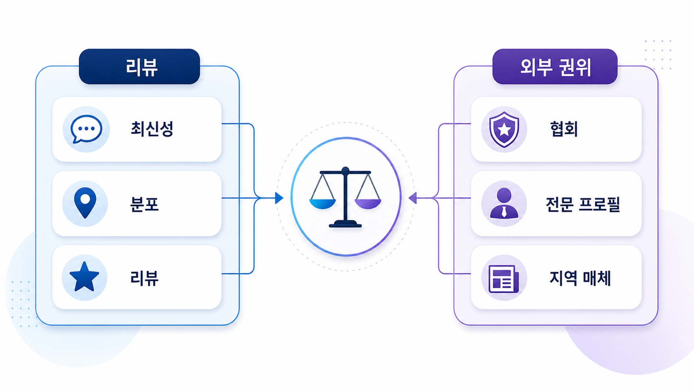

## 로컬 SEO/GEO 리뷰 전략: 네이버/지도/외부 후기


리뷰는 별점 숫자만의 문제가 아닙니다. 로컬 GEO에서는 리뷰의 최신성, 분포, 반복되는 방문 맥락, 답변 품질이 AI 답변의 후보 설명에 영향을 줄 수 있습니다.

특히 병원/전문 서비스는 리뷰를 다룰 때 더 조심해야 합니다. 효과 보장, 전후 비교, 과장 후기, 개인정보 노출은 신뢰 신호가 아니라 리스크가 됩니다.

[TOC]

## 리뷰는 양보다 맥락을 본다

리뷰가 많아도 오래됐거나 특정 이벤트에만 몰려 있으면 현재 방문 판단에 약합니다. AI 답변은 “친절하다” 같은 추상 평가보다 예약, 대기, 주차, 설명, 가격, 시설, 재방문 의사 같은 맥락을 더 잘 활용할 수 있습니다.

| 리뷰 신호 | 확인할 내용 | 운영 액션 |
|---|---|---|
| 최신성 | 최근 리뷰가 꾸준한가 | 리뷰 요청 리듬 점검 |
| 분포 | 채널별로 자연스럽게 쌓이는가 | 특정 채널 의존 줄이기 |
| 맥락 | 방문 조건이 보이는가 | FAQ/지점 페이지 보강 |
| 답변 품질 | 정중하고 구체적인가 | 답변 가이드 정리 |
| 리스크 | 과장/개인정보/효과 보장 | 검수와 수정 요청 |

## 리포트에서 먼저 확인할 기준

프롬프트 분석에는 후기 기반 질문을 넣습니다. “후기 좋은”, “대기 적은”, “설명 잘해주는”, “주차 편한” 같은 표현은 로컬 의사결정에서 자주 나옵니다.

인용 추적에서는 리뷰 플랫폼이나 지도 URL이 어떤 질문에서 근거가 되는지 봅니다. 공식 지점 페이지가 후기 맥락을 전혀 설명하지 못하면 AI 답변은 외부 리뷰에 더 의존합니다.

사이트 진단에서는 후기/사례/FAQ가 있는 공식 페이지의 구조를 봅니다. 리뷰 원문을 그대로 옮기기보다 방문 전 질문에 답하는 FAQ와 안내 문장으로 정리해야 합니다.



*리뷰는 별점이 아니라 방문 전 질문에 답하는 실제 맥락과 답변 품질로 읽어야 한다.*

## 가상 기업 AcmeClinic 예시

AcmeClinic은 별점은 높지만 리뷰가 1년 전 이벤트 기간에 몰려 있습니다. 최근 질문에서는 “대기 시간이 긴가요?”가 반복되는데 공식 페이지에는 예약/대기 안내가 없습니다.

이 경우 리뷰를 조작하거나 과하게 요청하는 것이 아니라, 방문 후 자연스러운 리뷰 요청 리듬을 정하고, 공식 FAQ에 예약/대기/주차 정보를 보강합니다. 리뷰 답변은 효과 보장 대신 확인 가능한 안내와 감사 표현 중심으로 씁니다.

## 정리 양식

```text
대표 후기 질문:
주요 리뷰 채널:
최근 리뷰 흐름:
반복 방문 맥락:
공식 FAQ 보강 항목:
주의할 리스크 표현:
리뷰 답변 가이드:
재측정 질문:
```

## 다음 흐름

리뷰 맥락을 이해했다면 지역 질문을 실제 전화/예약/길찾기 전환으로 이어지게 만들어야 합니다. 이어서 [병원/오프라인 매장 GEO 질문셋과 방문 전환](https://wikidocs.net/346611)을 봅니다.
