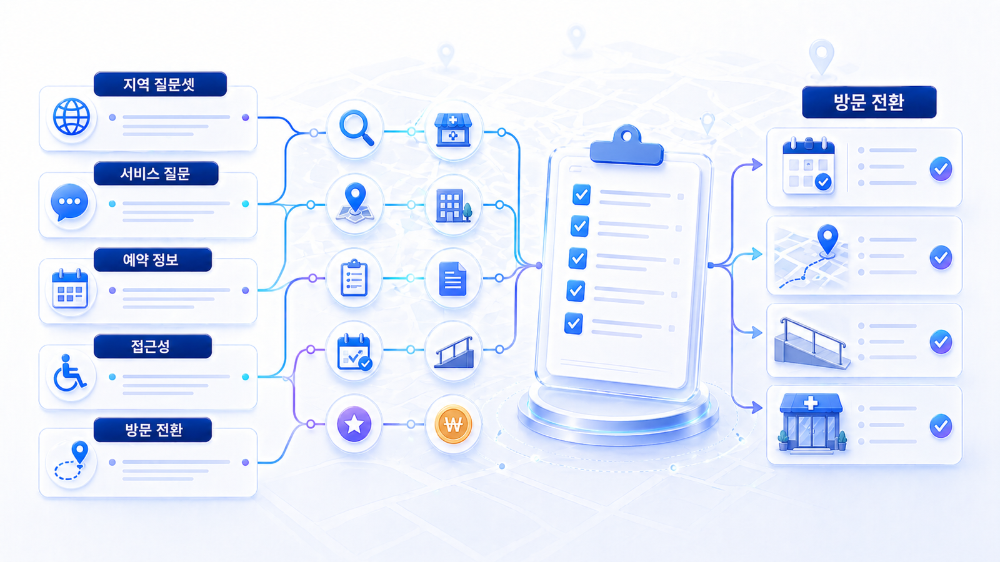

## 병원/오프라인 매장 GEO 질문셋과 방문 전환 체크리스트



로컬 업종의 GEO 질문셋은 단순 키워드 목록이 아닙니다. 사용자가 실제 방문을 결정하기 전 묻는 질문을 모아야 합니다. 지역, 서비스, 상황, 비용, 후기, 예약, 접근성, 리스크가 함께 들어가야 합니다.

좋은 질문셋은 콘텐츠 주제를 정하는 데서 끝나지 않습니다. 어떤 지도 프로필을 고칠지, 어떤 리뷰 신호가 필요한지, 어떤 지점 페이지를 보강할지, 어떤 전환 정보를 명확히 할지까지 이어져야 합니다.

[TOC]

## 지역 질문셋의 기본 구조

| 질문 묶음 | 예시 | 필요한 정보 |
|---|---|---|
| 지역+서비스 | 강남 피부과 보톡스 추천 기준은? | 지점 페이지, 서비스 설명, 리뷰 |
| 지역+상황 | 분당에서 야간 진료 가능한 치과는? | 영업시간, 예약 가능 시간, 지도 정보 |
| 비용/가격 | 홍대 왁싱샵 가격은 어느 정도인가? | 가격 범위, 상담/예약 안내 |
| 후기/신뢰 | 동탄 피부과 후기는 어떻게 봐야 하나? | 리뷰 분포, 영수증 리뷰, 외부 후기 |
| 전문성 | 도수치료 병원 고를 때 전문성은 무엇을 봐야 하나? | 전문가 프로필, 자격, 장비/프로그램 |
| 접근성 | 주차 가능한 산부인과는 어디인가? | 주차, 대중교통, 건물 입구 |
| 리스크 | 시술 전 어떤 부작용을 확인해야 하나? | 주의사항, 상담 기준, 규제 안전 표현 |

## 지점형 병원/매장의 질문셋 나누기

여러 지점이 있는 브랜드는 질문셋을 브랜드 단위와 지점 단위로 나눠야 합니다.

| 단위 | 질문 예시 | 연결 자산 |
|---|---|---|
| 브랜드 전체 | OO피부과는 어떤 시술을 잘하나? | 브랜드 소개, 전체 서비스, 의료진/전문가 철학 |
| 지역 지점 | OO피부과 강남역점 보톡스 예약은? | 강남역점 페이지, 네이버 플레이스, 지도 |
| 서비스 | 리프팅 시술 전 확인할 점은? | 서비스 설명, FAQ, 주의사항 |
| 상황 | 첫 방문 상담 전에 준비할 것은? | 예약 안내, 준비물, 비용 범위 |
| 비교 | 강남역 피부과 선택 기준은? | 선택 기준 콘텐츠, 리뷰/외부 권위 |

이 구조가 없으면 모든 질문이 대표 홈페이지로 몰립니다. 그러면 지점별 차이, 지역 수요, 전환 경로가 흐려집니다.

## 방문 전환 정보 체크리스트

AI 답변에서 언급되어도 사용자가 다음 행동을 못 하면 성과로 이어지지 않습니다. 로컬 업종은 콘텐츠 마지막에 방문 전환 정보가 분명해야 합니다.

| 전환 정보 | 확인 질문 |
|---|---|
| 예약 | 온라인 예약, 전화 예약, 채팅 상담 중 무엇이 가능한가? |
| 시간 | 영업시간, 휴무일, 점심시간, 야간 운영이 명확한가? |
| 비용 | 가격표가 어렵다면 최소한 비용 범위나 상담 기준을 설명하는가? |
| 위치 | 역 출구, 주차, 건물 입구, 엘리베이터, 층수 안내가 있는가? |
| 준비물 | 방문 전 필요한 서류, 사진, 복장, 금식, 주의사항이 있는가? |
| 리스크 | 의료/법률/전문 서비스의 한계와 주의사항을 설명하는가? |
| 문의 | 전화번호, 예약 링크, 상담 가능 시간이 최신인가? |

## 의료/전문 서비스 표현 리스크

병원, 법률, 금융, 보험, 건강기능식품, 미용 시술처럼 규제가 강한 업종은 GEO를 한다고 해서 표현 기준이 느슨해지지 않습니다. 오히려 AI 답변에 잘못 인용될 수 있으므로 더 조심해야 합니다.

피해야 할 표현은 다음과 같습니다.

- 모든 사람에게 동일한 효과를 보장하는 표현
- 전후 사진이나 후기를 과도하게 일반화하는 표현
- 특정 리뷰 작성을 유도하거나 대가를 암시하는 표현
- 경쟁 업체를 단정적으로 낮추는 표현
- 진료/상담 없이 결과를 예측하는 표현
- 개인정보나 민감한 상담 내용을 드러내는 답변

안전한 방향은 `선택 기준`, `상담 전 확인할 점`, `가능한 경우와 어려운 경우`, `주의사항`, `방문 전 준비물` 중심으로 설명하는 것입니다.

## 2주 실행 순서

| 기간 | 할 일 | 결과물 |
|---|---|---|
| 1~2일차 | 대표 지역/서비스 5개 선정 | 우선 질문셋 |
| 3~4일차 | NAP와 지도 프로필 점검 | 수정 리스트 |
| 5~6일차 | 리뷰/외부 권위 신호 확인 | 리뷰/출처 맵 |
| 7~9일차 | 지점 페이지와 FAQ 보강 | 지역 랜딩/FAQ 초안 |
| 10~12일차 | AI 답변에서 언급/근거/인용 확인 | 기준선 리포트 |
| 13~14일차 | 전환 정보와 리스크 문구 수정 | 30일 액션 플랜 |

## 지역 질문셋 기준선 측정표

| 질문 | AI/검색 환경 | 우리 브랜드/지점 mention | 답변 근거(source) | 화면 인용(citation) | 지도/리뷰 신호 | 전환 정보 누락 | 다음 액션 |
|---|---|---|---|---|---|---|---|
| 강남역 보톡스 상담 전 확인할 기준은? | ChatGPT/Perplexity/Google AI 기능 | 있음/없음 | 지점 페이지/블로그/플레이스 | URL | 리뷰/영업시간/의료진 | 가격 범위/주차 | FAQ 보강 |
| 분당 야간 진료 치과 추천 기준은? |  |  |  |  |  |  |  |
| 홍대 왁싱샵 예약 전 확인할 점은? |  |  |  |  |  |  |  |

이 표는 10장의 기준선 리포트와 같은 방식으로 운영합니다. 지역 질문은 답변이 자주 바뀔 수 있으므로 날짜, 모델, 지역 조건, 질문 원문을 함께 남깁니다.

## 질문셋 작성 양식

```text
지역 / 서비스 / 상황 / 사용자가 묻는 질문 / 현재 답변 자산 / 지도/리뷰 신호 / 부족한 전환 정보 / 우선 액션
```

## 예시

| 항목 | 예시 |
|---|---|
| 지역 | 강남역 |
| 서비스 | 피부과 보톡스 |
| 상황 | 첫 방문 상담 전 비교 |
| 질문 | 강남역에서 보톡스 상담 전 어떤 기준을 봐야 하나? |
| 현재 답변 자산 | 지점 페이지, 네이버 플레이스, FAQ 일부 |
| 지도/리뷰 신호 | 영수증 리뷰는 있으나 서비스별 리뷰 분류 부족 |
| 부족한 전환 정보 | 가격 범위, 상담 시간, 주차 안내 |
| 우선 액션 | 지점 FAQ와 플레이스 사진/설명 보강 |

## 질문셋을 콘텐츠와 지도 액션으로 바꾸기

질문셋은 작성만 해서는 효과가 없습니다. 각 질문이 어느 자산을 고치게 만드는지 연결해야 합니다.

| 질문 유형 | 콘텐츠 액션 | 지도/리뷰 액션 | 전환 액션 |
|---|---|---|---|
| 지역+서비스 | 지점별 서비스 설명과 선택 기준 작성 | 플레이스 카테고리/서비스명 확인 | 예약 링크와 상담 가능 시간 명시 |
| 근처+상황 | 야간/주말/주차/응급성 여부 FAQ 작성 | 영업시간, 특별 영업시간, 위치 핀 확인 | 전화 가능 시간과 방문 준비물 안내 |
| 후기/신뢰 | 리뷰 읽는 법, 전문가 프로필, 외부 권위 설명 | 리뷰 답변 기준과 플랫폼별 분포 확인 | 상담 전 확인할 점 안내 |
| 비용/가격 | 가격 범위, 비용이 달라지는 조건 설명 | 메뉴/서비스 가격 표시 가능 여부 확인 | 견적/상담 신청 경로 정리 |
| 리스크/주의사항 | 부작용/한계/대상별 주의사항 설명 | 과장 리뷰/후기 표현 점검 | 법적 고지와 문의 경로 명확화 |

이렇게 연결하면 `AI에 나오기 위한 질문셋`이 아니라 `사용자가 실제로 선택하고 방문할 수 있게 만드는 운영 체크리스트`가 됩니다.

## 참고 링크

질문셋을 만드는 방법은 [03-01 Fan-out 질문맵](https://wikidocs.net/346344)과 연결됩니다. 로컬 업종에서는 여기에 지역, 지도, 리뷰, 예약 전환 축을 추가하면 됩니다. 측정 기준은 [02-03 브랜드 언급률, 답변 근거, 화면 인용](https://wikidocs.net/346603)에서 다시 확인할 수 있습니다.

HaloX의 [GEO 콘텐츠 구조화 가이드](https://haloxlabs.ai/ko/blog/geo-content-structure)는 질문을 콘텐츠 구조로 바꾸는 데 참고할 수 있고, [HaloX 공식 사이트](https://haloxlabs.ai/)에서는 AI 검색 모니터링과 브랜드 가시성 분석 흐름을 확인할 수 있습니다. 병원/전문 서비스처럼 표현 리스크가 큰 업종은 다음 [12-06 의료광고와 후기 리스크](https://wikidocs.net/346615)에서 따로 점검합니다.

## 완료 기준

- 지역/서비스/상황별 질문셋이 최소 30개 있습니다.
- 브랜드 전체 질문과 지점별 질문이 분리되어 있습니다.
- 각 질문이 콘텐츠/지도/리뷰/전환 액션 중 하나로 연결됩니다.
- 예약, 전화, 길찾기, 주차, 비용 범위, 준비물 정보가 누락되지 않았습니다.
- 의료/전문 서비스는 위험 표현을 12-06 기준으로 다시 검수했습니다.

## 정리

병원/오프라인 매장의 GEO는 새로운 유행어가 아니라 로컬 SEO의 기본 신호를 AI 답변 시대에 맞게 다시 연결하는 작업입니다. NAP, 지도, 리뷰, 외부 권위, 지역 콘텐츠, 방문 전환 정보가 맞물릴 때 AI 답변에서도 더 안정적인 추천 근거가 만들어집니다.
