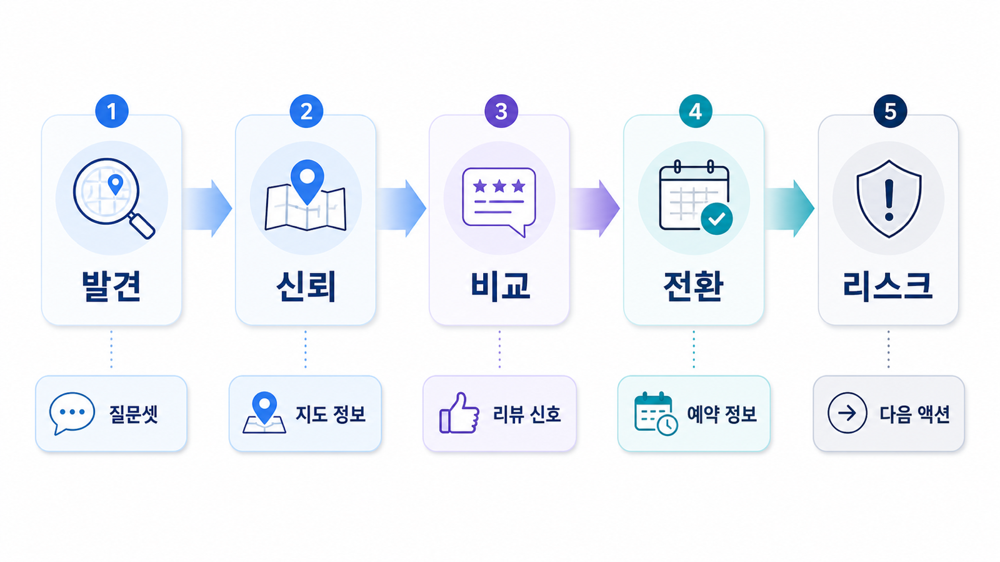

## 병원/오프라인 매장 GEO 질문셋과 방문 전환 체크리스트


로컬 GEO 질문셋은 “지역명 + 업종”으로 끝나지 않습니다. 사용자는 방문 목적, 시간, 증상, 가격, 예약 가능성, 후기, 주차 같은 조건을 붙여 묻습니다.

방문 전환을 보려면 AI 답변에 이름이 나오는지만 세면 부족합니다. 답변을 본 사람이 전화, 예약, 길찾기, 상담 신청으로 넘어갈 이유가 보이는지 확인해야 합니다.

[TOC]

## 먼저 볼 기준

| 기준 | 읽는 법 |
|---|---|
| 질문 | 지역/상황/시간/비용/후기를 조합해 만든다 |
| 답변 | 추천 이유와 제외 이유를 함께 본다 |
| 전환 | 예약/전화/길찾기 정보가 답변 뒤에 이어지는지 본다 |

## 점검 흐름

1. 대표 고객 상황 3개를 정한다
2. 각 상황을 지역 질문 5개로 바꾼다
3. AI 답변에서 추천 기준과 경쟁 지점을 기록한다
4. 전환에 필요한 정보가 빠진 페이지를 찾는다
5. 같은 질문으로 수정 전후를 비교한다



*지역 질문셋 방문 전환 퍼널*

## 방문 전환 예시

AcmeDental은 “퇴근 후 갈 수 있는 강남역 치과” 질문에서 야간 진료, 예약 가능 시간, 지하철 출구, 리뷰 맥락이 함께 보여야 합니다. 이름이 언급되어도 이 정보가 없으면 전환은 약합니다.

## 정리 양식

```text
대표 고객 상황:
지역 질문:
AI 추천 기준:
경쟁 지점:
부족한 전환 정보:
수정할 페이지/프로필:
```

## 다음 흐름

의료 표현 리스크는 [의료광고와 후기 리스크](https://wikidocs.net/346615)에서 확인합니다.
