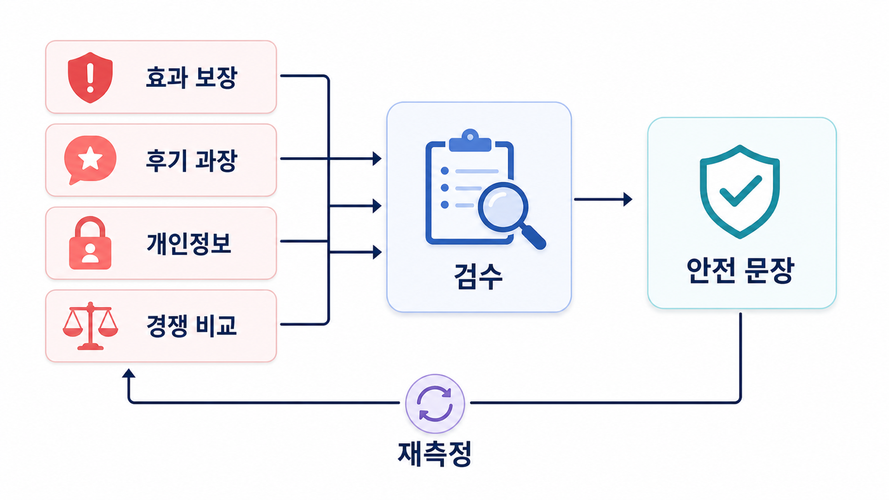

## 병원 SEO/GEO 의료광고와 후기 표현 리스크


병원/의료 분야의 GEO는 노출보다 신뢰와 표현 안전이 먼저입니다. AI 답변이 병원을 추천하더라도 효과 보장, 전후 비교, 과장 후기, 개인정보가 섞이면 리스크가 커집니다.

이 페이지는 법률 자문이 아니라 운영 관점의 점검표입니다. 실제 의료광고/개인정보/후기 정책은 전문가 검토를 거쳐야 하며, GEO 문서에서는 위험 표현을 줄이고 공식 안내를 명확히 하는 기준을 세웁니다.

[TOC]

## 의료/전문 업종은 YMYL 관점으로 본다

건강, 돈, 안전에 영향을 주는 질문은 YMYL 성격이 강합니다. AI 답변이 근거로 삼는 URL도 더 신중하게 관리해야 합니다. 병원 콘텐츠는 “더 많이 노출되게 하자”보다 “위험한 문장으로 노출되지 않게 하자”가 먼저입니다.

| 리스크 유형 | 예시 | 운영 기준 |
|---|---|---|
| 효과 보장 | 무조건 개선, 100% 해결 | 단정 대신 조건/개인차 안내 |
| 전후 비교 | 과도한 Before/After | 정책과 동의/표현 검토 |
| 후기 인용 | 개인 경험을 일반화 | 리뷰 원문보다 공식 FAQ로 정리 |
| 개인정보 | 진료 내용 노출 | 익명화와 비식별 처리 |
| 최신성 | 예전 진료/가격/시간 | 업데이트 날짜와 공식 안내 |

## 리포트에서 먼저 확인할 기준

프롬프트 분석에서는 위험 질문을 따로 묶습니다. “효과 좋은”, “부작용 없는”, “가격 싼”, “후기 좋은” 같은 질문은 AI 답변의 표현을 확인해야 합니다.

인용 추적에서는 문제가 된 표현이 공식 사이트, 지도 후기, 외부 블로그, 커뮤니티 중 어디에서 왔는지 봅니다. 공식 URL이 위험 표현을 만들고 있다면 즉시 수정하고, 외부 출처라면 공식 안내와 수정 요청을 병행합니다.

사이트 진단에서는 의료/전문 안내 페이지의 title, description, FAQ, schema, 업데이트 날짜를 확인합니다. 오래된 이벤트/가격/후기 페이지가 남아 있으면 위험 citation이 될 수 있습니다.



*병원/전문 업종의 GEO는 노출보다 위험 질문과 citation 표현을 먼저 통제해야 합니다.*

## 위험 문장 Before/After

의료/전문 업종에서는 좋은 문장이 반드시 더 강한 문장일 필요는 없습니다. 정확하고 조심스럽고 확인 가능한 문장이 더 좋은 문장입니다.

| 구분 | 수정 전 | 수정 후 | 수정 이유 |
|---|---|---|---|
| 효과 보장 | “여드름 흉터를 빠르게 없애드립니다.” | “여드름 흉터 치료는 피부 상태, 흉터 유형, 치료 반응에 따라 필요한 기간과 방법이 달라질 수 있습니다.” | 결과 단정을 줄이고 개인차를 안내함 |
| 부작용 표현 | “부작용 걱정 없는 시술입니다.” | “시술 전 피부 상태와 병력에 따라 부작용 가능성을 상담하고, 필요한 경우 대체 방법을 안내합니다.” | “부작용 없음”이라는 단정을 피함 |
| 후기 일반화 | “후기에서 모두 만족한 치료입니다.” | “후기는 개인 경험이며, 치료 결과는 개인별 상태와 관리 방식에 따라 달라질 수 있습니다.” | 개인 경험을 일반 결과처럼 보이게 하지 않음 |
| 가격 표현 | “가장 저렴한 병원입니다.” | “진료 범위와 시술 방식에 따라 비용이 달라질 수 있으므로 상담 시 세부 비용을 확인해야 합니다.” | 가격 비교/최저가 단정을 피함 |
| 전후 비교 | “전후 사진처럼 누구나 개선됩니다.” | “전후 이미지는 특정 사례이며, 동일한 결과를 보장하지 않습니다.” | 사례와 보장을 분리함 |

## 공식 FAQ로 바꾸는 예시

AI 답변이 위험한 후기나 외부 블로그를 반복해서 인용한다면, 공식 사이트에 더 안전한 FAQ를 만들어야 합니다. 목표는 광고 문구를 늘리는 것이 아니라 AI가 참고할 수 있는 정확한 설명을 제공하는 것입니다.

| 위험 질문 | 공식 FAQ 제목 예시 | 답변에 포함할 기준 |
|---|---|---|
| “여드름 흉터 빨리 없애는 병원” | 여드름 흉터 치료 기간은 어떻게 정해지나요? | 흉터 유형, 피부 상태, 치료 간격, 개인차 |
| “부작용 없는 리프팅 시술” | 리프팅 시술 전 어떤 부작용을 확인해야 하나요? | 상담 필요성, 주의사항, 회복 과정 |
| “가격 싼 치과 임플란트” | 임플란트 비용은 어떤 항목으로 구성되나요? | 진단, 재료, 치료 범위, 추가 검사 |
| “후기 좋은 피부과 추천” | 병원 선택 전 어떤 정보를 확인해야 하나요? | 진료 분야, 의료진, 공식 안내, 상담 절차 |

## 가상 기업 AcmeClinic 예시

AcmeClinic은 설명을 위한 가상 병원명이며, 실제 고객 사례가 아닙니다.

AcmeClinic은 “여드름 흉터 빨리 없애는 병원” 질문에서 AI 답변에 등장합니다. 하지만 답변은 외부 후기의 표현을 근거로 “빠른 개선”을 강하게 말합니다. 공식 사이트에는 개인차와 상담 필요성에 대한 안내가 약합니다.

이때 수정 방향은 광고성 문장을 더하는 것이 아닙니다. 공식 FAQ에 조건, 개인차, 상담 필요성을 명확히 쓰고, 오래된 이벤트 페이지와 후기 인용 문장을 점검합니다. 재측정에서는 mention이 늘었는지보다 위험 표현이 줄었는지를 먼저 봅니다.

## 운영 점검 순서

1. 위험 질문을 먼저 묶습니다. 효과/부작용/가격/후기/전후 비교 질문을 분리합니다.
2. AI 답변에서 위험 문장을 그대로 적습니다. 문장을 바꾸어 요약하지 않습니다.
3. citation URL을 확인합니다. 공식 사이트인지, 지도 후기인지, 외부 블로그인지 구분합니다.
4. 공식 안내 URL을 정합니다. 없으면 FAQ나 안내 페이지를 새로 만듭니다.
5. 수정 전/후 문장을 남깁니다. 법무/의료광고 검토가 필요한 표현은 별도로 표시합니다.
6. 같은 질문셋으로 재측정합니다. 노출보다 위험 표현 감소를 먼저 확인합니다.

## 정리 양식

```text
위험 질문:
AI 답변의 위험 문장:
반복 citation URL:
공식 안내 URL:
수정 전 표현:
수정 후 표현:
검토 담당:
전문가 검토 필요 여부:
외부 수정 요청:
재측정 질문:
```

## 완료 기준

아래 항목이 채워지면 의료/전문 업종의 GEO 리스크 점검을 한 차례 완료한 상태로 볼 수 있습니다.

- 위험 질문군이 효과/부작용/가격/후기/전후 비교로 분리됐다.
- 위험 문장의 출처가 공식 사이트/지도 후기/외부 블로그/커뮤니티 중 어디인지 확인됐다.
- 공식 FAQ 또는 안내 페이지에 더 안전한 설명이 보강됐다.
- 수정 전/후 문장이 기록됐고, 전문가 검토가 필요한 표현이 따로 표시됐다.
- 같은 질문셋으로 재측정할 일정이 정해졌다.

## 다음 흐름

개별 리스크를 관리하려면 30일 단위 운영 루프가 필요합니다. 이어서 [로컬 SEO/GEO 30일 운영 워크플로우](https://wikidocs.net/346984)를 봅니다.
