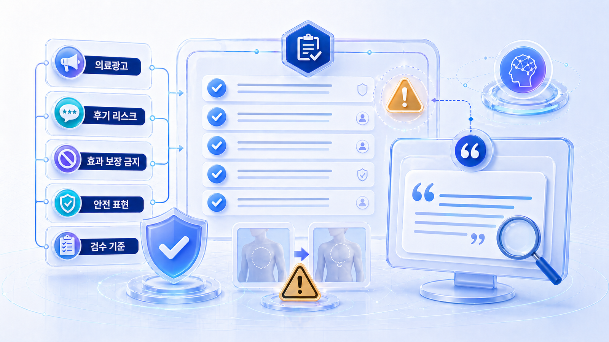

## 의료광고와 후기 리스크: 병원 SEO/GEO에서 조심할 표현

병원과 전문 서비스의 SEO/GEO는 노출만 보면 위험합니다. AI 검색에서 더 자주 언급되는 것보다 먼저 봐야 할 것은 `안전하게 인용될 수 있는 표현인가`입니다.

의료, 법률, 금융, 건강, 미용 시술처럼 사용자의 신체/재산/권리에 영향을 줄 수 있는 업종은 광고 표현, 후기 활용, 전후 사진, 효과 보장, 개인정보 노출에 특히 조심해야 합니다. GEO 관점에서는 이런 표현이 AI 답변에 잘못 요약되거나 과장된 추천 근거처럼 재사용될 수 있다는 점까지 함께 봐야 합니다.

[TOC]

## 왜 별도로 봐야 하나

일반 로컬 업종은 위치, 영업시간, 리뷰, 예약 전환이 핵심 기준으로 봅니다. 병원/전문 서비스는 여기에 규제와 신뢰 리스크가 더해집니다. 검색엔진이나 AI가 어떤 문장을 답변 근거로 가져갈지 완전히 통제할 수 없기 때문에, 원문 자체를 안전하게 만들어야 합니다.

| 리스크 | SEO에서의 문제 | GEO에서의 문제 |
|---|---|---|
| 효과 보장 표현 | 과장 광고로 보일 수 있다 | AI가 결과를 보장하는 추천처럼 요약할 수 있다 |
| 후기 과다 활용 | 후기 유도/광고 표기 문제가 생길 수 있다 | 특정 경험이 일반 결과처럼 인용될 수 있다 |
| 전후 사진 | 업종별 표시 기준을 위반할 수 있다 | 시각 자료 맥락 없이 성과처럼 해석될 수 있다 |
| 개인정보 노출 | 리뷰 답변/사례에서 민감 정보가 드러날 수 있다 | AI 답변에 개인 상황이 재조합될 수 있다 |
| 경쟁 비교 | 근거 없는 비교/비방으로 보일 수 있다 | AI가 비교 우위를 단정적으로 말할 수 있다 |

## 위험한 표현과 안전한 표현

핵심은 `우리가 최고다`가 아니라 `독자가 무엇을 확인해야 하는가`로 바꾸는 것입니다. 특히 병원 콘텐츠는 결과를 약속하기보다 판단 기준, 상담 전 확인할 점, 개인차, 주의사항을 설명해야 합니다.

| 위험한 방향 | 더 안전한 방향 |
|---|---|
| 누구나 확실한 효과를 볼 수 있습니다 | 개인 상태에 따라 결과가 달라질 수 있으므로 상담이 필요합니다 |
| 부작용이 거의 없습니다 | 가능한 부작용과 주의사항을 상담 전 확인해야 합니다 |
| 후기에서 효과가 입증됐습니다 | 후기는 개인 경험이며 일반 결과를 보장하지 않습니다 |
| 우리 병원이 가장 잘합니다 | 의료진/장비/상담 방식/위치/예약 조건을 비교 기준으로 제시합니다 |
| 전후 사진처럼 바뀔 수 있습니다 | 전후 사례는 개인차가 있으며 설명 목적의 자료로 봐야 합니다 |
| 지금 예약하면 무조건 할인됩니다 | 이벤트/비용 정보는 적용 조건과 기간을 함께 확인해야 합니다 |

## 네이버 영수증 리뷰 안내 시 주의점

네이버 영수증 리뷰는 실제 방문 기반 신호라는 점에서 중요하지만, 병원/전문 서비스에서는 더 조심해야 합니다. 리뷰를 많이 받는 것보다 안전하게 안내하는 것이 먼저입니다.

해야 할 일은 리뷰 작성 경로를 알려주는 것입니다. 하지 말아야 할 일은 별점, 문구, 시술명, 효과 표현, 특정 키워드를 요구하는 것입니다.

| 상황 | 가능한 안내 | 피해야 할 안내 |
|---|---|---|
| 결제/방문 후 | `방문 경험을 남기고 싶다면 영수증 리뷰를 이용할 수 있습니다` | `별점 5점을 남겨 주세요` |
| 예약 완료 메시지 | `리뷰 작성은 선택 사항입니다` | `리뷰를 쓰면 혜택을 드립니다` |
| 현장 안내문 | `서비스 개선을 위해 의견을 참고합니다` | `효과가 좋았다고 적어 주세요` |
| 부정 경험 발생 | `공식 문의 채널로 확인하겠습니다` | `리뷰를 삭제해 주세요` |

리뷰는 사용자의 자발적 경험이어야 합니다. 리뷰 수를 늘리기 위한 운영보다, 사용자가 불편 없이 방문하고 자연스럽게 의견을 남길 수 있는 경험 설계를 더 먼저 봅니다.

## 리뷰 답변에서 드러내면 안 되는 것

리뷰 답변은 공개 콘텐츠입니다. 담당자가 친절하게 답하려다 오히려 개인정보나 상담 내용을 드러내는 경우가 있습니다. 특히 병원은 방문 사실, 진료 내용, 시술명, 증상, 상담 세부를 공개 답변에서 확인해 주지 않는 편이 안전합니다.

| 드러내면 위험한 정보 | 이유 | 안전한 답변 방향 |
|---|---|---|
| 방문 날짜/진료 내용 | 개인의 이용 사실을 확인할 수 있다 | `남겨주신 의견은 내부적으로 확인하겠습니다` |
| 시술명/상담 내용 | 민감한 건강 정보가 될 수 있다 | `자세한 내용은 공식 연락처로 문의해 주세요` |
| 방문자 실명/연락처 일부 | 식별 가능성이 생긴다 | 개인 식별 정보 없이 일반 응대 |
| 의료진 판단 세부 | 공개 논쟁으로 번질 수 있다 | 사실 확인은 외부에 드러내지 않는 채널로 안내 |
| 부정 리뷰 반박 자료 | 추가 개인정보 노출 위험이 있다 | 차분한 사과/확인/재발 방지 안내 |

## AI 답변에 잘못 인용될 수 있는 문장

GEO에서는 원문이 AI 답변의 재료가 될 수 있습니다. 따라서 본문, FAQ, 플레이스 설명, 리뷰 답변, 블로그 글에서 아래와 같은 문장을 줄이는 것이 좋습니다.

- `무조건`, `확실히`, `완벽하게`, `부작용 없이`처럼 결과를 단정하는 말
- `1위`, `최고`, `유일`, `압도적`처럼 근거가 필요한 우월 표현
- 특정 후기 하나를 일반 결과처럼 말하는 문장
- 상담 없이 비용/결과/회복 기간을 단정하는 문장
- 경쟁 업체를 낮추는 비교 문장
- 사용자의 증상, 치료 이력, 상담 내용을 암시하는 답변

반대로 AI가 안전하게 요약해도 문제가 적은 문장은 다음에 가깝습니다.

- `상담 전 확인할 기준은 무엇인가`
- `개인 상태에 따라 달라질 수 있는 요소는 무엇인가`
- `예약 전 준비해야 할 정보는 무엇인가`
- `위치, 시간, 비용 범위, 주차, 상담 가능 여부는 어떻게 확인하는가`
- `부작용이나 제한 사항은 어떤 방식으로 확인해야 하는가`

## 의료광고 검수 흐름

이 페이지는 법률 자문이 아니라 콘텐츠 운영 체크리스트입니다. 실제 의료광고 가능 여부는 의료법, 의료광고 심의 기준, 플랫폼 정책, 내부 컴플라이언스 기준을 함께 확인해야 합니다.

| 단계 | 확인할 것 | 결과물 |
|---|---|---|
| 1 | 광고/정보/후기/사례 중 무엇인지 구분 | 콘텐츠 유형 분류 |
| 2 | 효과 보장, 비교 우위, 전후 사진, 가격 이벤트 표현 확인 | 위험 표현 목록 |
| 3 | 후기/리뷰 요청 방식과 공개 답변 점검 | 리뷰 운영 기준 |
| 4 | 개인정보/보호해야 할 상담 정보가 드러나는지 확인 | 삭제/수정 필요 문장 |
| 5 | 안전한 설명 문장으로 교체 | 선택 기준/주의사항/상담 필요성 중심 문안 |
| 6 | AI 질문셋에 넣어 재측정 | 잘못 요약될 수 있는 표현 확인 |

*의료와 전문 서비스는 효과 보장, 후기 일반화, 개인정보 노출, 과장 비교를 먼저 걸러 안전한 설명 문장으로 바꿔야 한다.*

## 병원 페이지 점검 체크리스트

| 점검 항목 | 확인 질문 |
|---|---|
| 첫 문단 | 결과 보장보다 선택 기준과 상담 필요성을 먼저 말하는가? |
| FAQ | 비용/효과/부작용 질문에 단정 대신 확인 기준으로 답하는가? |
| 후기 | 특정 후기를 일반 결과처럼 소개하지 않는가? |
| 전후 사진 | 업종별 표시 기준과 설명 맥락을 확인했는가? |
| 의료진/전문가 | 자격/경력/진료 범위를 사실 중심으로 적었는가? |
| 리뷰 답변 | 개인정보, 방문 사실, 상담 내용을 드러내지 않는가? |
| 플레이스 설명 | 과장 문구보다 위치/대상/예약/주의사항을 담았는가? |
| AI 질문셋 | `추천` 질문뿐 아니라 `주의사항`, `상담 전 확인`, `개인차` 질문을 포함했는가? |

## 병원 외 전문 서비스에도 적용된다

이 기준은 병원만의 문제가 아닙니다. 법률, 세무, 금융, 보험, 건강기능식품, 미용, 교육처럼 사용자의 중요한 의사결정에 영향을 주는 업종도 비슷하게 봐야 합니다.

공통 기준은 간단합니다. 결과를 약속하지 말고, 선택 기준을 설명합니다. 개인 사례를 일반화하지 말고, 확인 절차를 안내합니다. 리뷰를 조작하지 말고, 자연스럽고 안전한 경험을 설계합니다.

## 페이지 유형별 안전한 작성 방향

| 페이지 유형 | 안전한 중심 | 피해야 할 중심 |
|---|---|---|
| 진료/시술 소개 | 대상, 절차, 상담 전 확인할 점, 주의사항 | 모든 사람에게 같은 효과 보장 |
| 의료진 프로필 | 자격, 경력, 진료 범위, 학회/연구 이력 | 근거 없는 최고/유일 표현 |
| 비용 안내 | 비용이 달라지는 요소, 상담 필요성, 적용 조건 | 무조건 최저가/확정 가격 단정 |
| 후기/사례 | 개인 경험이며 일반화할 수 없다는 전제 | 특정 후기를 대표 결과처럼 사용 |
| 플레이스 설명 | 위치, 진료 시간, 예약, 주차, 상담 범위 | 효과/결과/순위 과장 |
| FAQ | 확인 기준과 개인차 안내 | 진료 없이 결과/회복 기간 단정 |

## 병원 SEO/GEO는 YMYL 관점으로 봐야 한다

병원, 건강, 치료, 시술 관련 콘텐츠는 사용자의 건강과 안전에 영향을 줄 수 있습니다. 검색엔진과 AI 답변 모두 이런 주제를 더 조심스럽게 다루며, 실무에서는 이를 YMYL 성격의 콘텐츠로 보고 보수적으로 작성해야 합니다.

| 항목 | 안전한 방향 | 위험한 방향 |
|---|---|---|
| 치료/시술 설명 | 대상, 절차, 상담 필요성, 주의사항을 설명 | 효과를 단정하거나 모두에게 적합하다고 표현 |
| 후기 | 실제 리뷰 정책 안에서 일반적인 경험을 다룸 | 특정 치료 효과를 보장하는 후기처럼 활용 |
| 전후 사진 | 법/플랫폼 정책에 맞게 제한적으로 검토 | 전후 차이를 과장하거나 보편적 결과처럼 암시 |
| 의료진 소개 | 자격, 경력, 진료 분야를 사실 중심으로 제시 | 최고/유일/1위처럼 검증 어려운 표현 사용 |
| 가격 안내 | 상담/상태에 따라 달라질 수 있음을 명시 | 무조건 최저가, 이벤트성 자극 문구만 강조 |

GEO에서는 자사 페이지의 표현뿐 아니라 AI가 답변에 가져갈 수 있는 외부 후기/블로그/기사 표현도 함께 봐야 합니다. 외부 문장이 과장되어 있으면 AI 답변의 리스크가 커질 수 있습니다.

## 의료광고 SEO에서 자주 생기는 위험 패턴

| 패턴 | 왜 위험한가 | 안전하게 바꾸는 방향 |
|---|---|---|
| 효과 보장 | 개인별 차이를 무시함 | 상담 후 개인 상태에 맞춰 판단한다고 설명 |
| 공포 자극 | 불안을 과도하게 키움 | 증상/상황별 확인 기준을 차분히 안내 |
| 과도한 비교 | 타 병원 비방/우월 주장으로 읽힐 수 있음 | 선택 기준과 확인 질문을 제공 |
| 후기 과장 | 개별 경험을 일반 결과처럼 보이게 함 | 리뷰는 참고 정보이며 개인차가 있음을 명시 |
| 가격 미끼 | 실제 비용과 차이가 날 수 있음 | 포함/불포함 항목과 상담 필요성을 설명 |
| 개인정보 노출 | 환자 정보가 드러날 수 있음 | 답변에서 진료 내용/개인 상황을 언급하지 않음 |

## AI 답변 리스크 모니터링 항목

병원 GEO에서는 단순히 브랜드가 언급되는지만 보면 안 됩니다. 답변이 안전한지, 과장된 표현이 없는지, 출처가 믿을 만한지 함께 확인해야 합니다.

| 확인 항목 | 질문 | 조치 |
|---|---|---|
| 효과 단정 | AI가 치료 효과를 보장하듯 말하는가? | 자사 문구 수정, 주의사항/상담 안내 보강 |
| 의료진/기관 정보 | 자격/소속/지점 정보가 정확한가? | NAP/프로필/지점 페이지 수정 |
| 후기 인용 | 개별 후기를 일반 결과처럼 쓰는가? | 후기 운영 가이드와 외부 콘텐츠 점검 |
| 가격/이벤트 | 실제 조건과 다르게 안내하는가? | 가격 안내 페이지와 이벤트 종료 정보 정리 |
| 개인정보 | 답변/리뷰 답변에 개인 정보가 드러나는가? | 리뷰 답변 템플릿 재교육 |
| 출처 품질 | 광고성 글이나 오래된 글을 근거로 쓰는가? | 공식 페이지/FAQ/전문 프로필 보강 |

## 검수 책임을 문서화하기

병원/전문 서비스는 콘텐츠 발행 전에 책임 구간을 나눠야 합니다.

| 역할 | 검수 내용 | 산출물 |
|---|---|---|
| 마케팅 담당 | 검색 의도, 제목, 전환 CTA, 채널별 노출 | 초안과 SEO 체크리스트 |
| 의료/전문 담당 | 사실관계, 시술/치료 설명, 금지 표현 | 전문 검수 코멘트 |
| 법무/컴플라이언스 | 광고법, 개인정보, 후기/전후 사진 리스크 | 승인/수정 기록 |
| 운영 담당 | 예약/전화/영업시간/가격 안내 정확성 | 전환 정보 확인표 |
| GEO 담당 | AI 답변의 source/citation/리스크 측정 | 질문셋 측정 로그 |

이 기록이 남아야 나중에 AI 답변에서 문제가 생겼을 때 원인을 추적하고, 어떤 페이지/리뷰/외부 출처를 고쳐야 하는지 빠르게 찾을 수 있습니다.

## 참고 링크

로컬 리뷰와 외부 권위는 [12-04 리뷰 전략](https://wikidocs.net/346610)과 함께 봐야 합니다. 지역 질문셋과 방문 전환은 [12-05 병원/오프라인 매장 GEO 질문셋](https://wikidocs.net/346611)에서 정리한 표를 사용하면 됩니다.

콘텐츠 표현을 구조화할 때는 HaloX의 [GEO 콘텐츠 구조화 가이드](https://haloxlabs.ai/ko/blog/geo-content-structure)를 참고하고, 답변 근거와 화면 인용 같은 용어는 [GEO 용어 정리](https://haloxlabs.ai/ko/glossary)에서 다시 확인할 수 있습니다.

## 정리

병원/전문 서비스의 SEO/GEO는 더 많이 노출되는 기술이 아니라, 안전하게 발견되고 신뢰받는 구조를 만드는 일입니다. NAP, 지도, 리뷰, 외부 권위가 아무리 좋아도 본문과 리뷰 답변의 표현이 위험하면 AI 답변 시대에는 오히려 리스크가 커질 수 있습니다.
