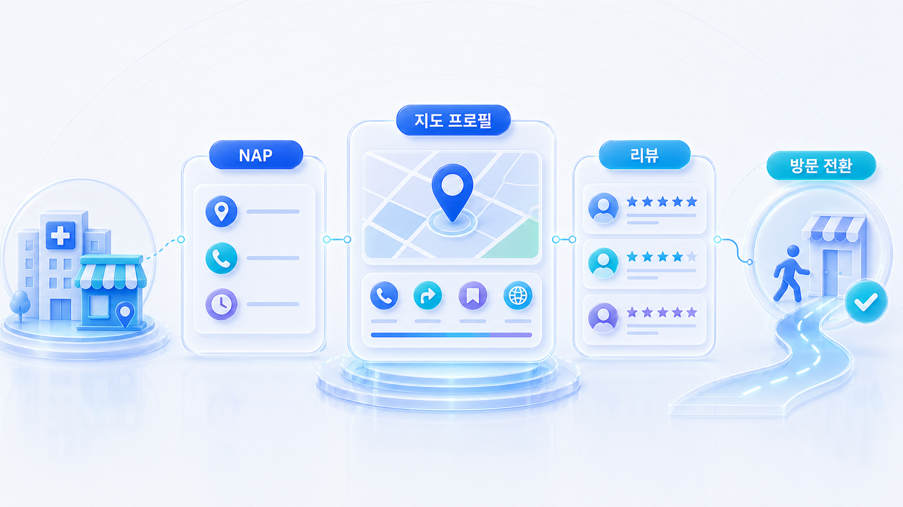
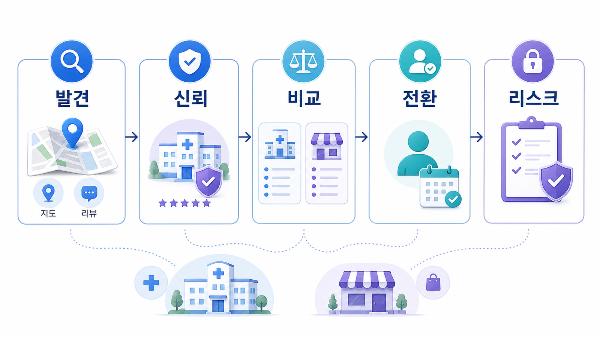

## 병원/오프라인 매장 SEO/GEO 전략

병원, 학원, 오프라인 매장, 로컬 전문 서비스는 일반 웹사이트 GEO와 다르게 접근해야 합니다. 사용자가 묻는 질문이 `어떤 브랜드가 좋은가`보다 `내 근처에서 어디를 가야 하나`, `후기가 믿을 만한가`, `예약이 가능한가`, `비용과 위치가 맞는가`에 가깝기 때문입니다.

이 장은 로컬 SEO의 기본 신호인 NAP, 지도 등록, 카테고리, 영업시간, 사진, 리뷰, 외부 권위, 지점 페이지를 먼저 정리합니다. 그 위에서 AI 검색과 GEO가 지역 질문, 비교 질문, 방문 전환 질문을 어떻게 읽을 수 있는지 봅니다.

[TOC]

## 로컬 업종은 왜 따로 봐야 하나

로컬 업종은 홈페이지 본문만 고쳐서는 부족합니다. 네이버 플레이스, Google Business Profile, 카카오맵, Apple Maps, 네이버 영수증 리뷰, 지도 리뷰, 외부 후기, 협회/전문 플랫폼 프로필이 함께 맞아야 합니다. GEO는 이 신호들이 AI 답변 안에서 추천 근거로 재조합되는 단계입니다.

병원/오프라인 매장은 일반 블로그 SEO처럼 키워드가 들어간 글을 많이 쓰는 방식만으로 움직이지 않습니다. 검색엔진과 지도 서비스는 업체를 하나의 지역 엔티티로 식별하고, 그 업체가 특정 지역/서비스 질문에 얼마나 관련 있는지 판단합니다.

## 로컬 업종의 GEO 운영 모델

로컬 업종은 `검색 노출 → 지도 후보 → 리뷰 검토 → 방문/예약` 흐름이 짧습니다. 그래서 GEO도 콘텐츠만 보지 않고, 사용자가 실제로 방문하기 전 확인하는 신호를 순서대로 맞춰야 합니다.

*로컬 업종의 GEO는 발견, 신뢰, 비교, 전환, 리스크를 분리해 보고 각 단계에 맞는 지도, 리뷰, 콘텐츠, 전환 자산을 맞춘다.*

12장의 목표는 더 많은 지역 키워드를 넣는 것이 아닙니다. 지도/리뷰/지점/전환/리스크 신호를 같은 기준으로 정리해 AI가 지역 추천을 만들 때 오해할 여지를 줄이는 것입니다.

## 로컬 SEO의 세 가지 기본 신호

로컬 GEO를 잘하려면 먼저 로컬 SEO의 작동 원리를 알아야 합니다. 핵심은 세 가지입니다.

- **관련성**: 사용자가 찾는 서비스와 업체 정보가 얼마나 맞는가
- **거리**: 사용자 위치 또는 검색 지역과 업체가 얼마나 가까운가
- **인지도/권위**: 리뷰, 외부 언급, 링크, 프로필, 실제 평판이 얼마나 쌓였는가

GEO는 이 세 신호가 AI 답변에서 다시 조합되는 단계입니다. AI가 `강남에서 야간 진료 가능한 치과`, `분당에서 주차가 편한 피부과`, `부산 해운대 근처 가족 외식 장소` 같은 질문을 받으면, 홈페이지 문장만 보는 것이 아니라 지도 프로필, 리뷰, 지역 페이지, 외부 후기, 영업시간, 예약 가능 여부를 함께 확인하려고 합니다.

## 이 장을 읽는 순서

먼저 [12-01. 로컬 SEO와 로컬 GEO 차이](https://wikidocs.net/346607)에서 차이를 잡고, [12-02. 로컬 SEO NAP 일관성: 이름/주소/전화번호 점검](https://wikidocs.net/346608)에서 지점별 기준값을 확정합니다. 그다음 [12-03. 네이버 플레이스, Google Business Profile, 지도 SEO](https://wikidocs.net/346609)에서 지도/플레이스 정보를 정비합니다.

리뷰와 외부 권위는 [12-04. 리뷰 전략](https://wikidocs.net/346610)에서 보고, 지역 질문셋과 방문 전환은 [12-05. 병원/오프라인 매장 GEO 질문셋과 방문 전환](https://wikidocs.net/346611)에서 다룹니다. 병원/전문 서비스라면 [12-06. 의료광고와 후기 리스크](https://wikidocs.net/346615)를 반드시 확인합니다. 30일 운영 흐름은 [12-07. 로컬 SEO/GEO 30일 운영 워크플로우](https://wikidocs.net/346984)에서 이어집니다.

## 07-03과 다른 점

[07-03 로컬/전문 서비스 GEO](https://wikidocs.net/346358)는 산업별 GEO 흐름 안에서 로컬 업종의 차이를 소개하는 브리지입니다. 이 장은 그중에서도 병원/오프라인 매장처럼 지도, 리뷰, 지점, 예약 전환이 중요한 업종을 더 깊게 다룹니다.

커머스가 상품 데이터와 피드 중심이라면, 로컬 업종은 지역 신뢰 데이터 중심입니다. 지도 정보가 틀리거나 리뷰 신호가 약하면 좋은 콘텐츠를 써도 실제 추천과 방문 전환으로 이어지기 어렵습니다.

## 발행 전 점검할 것

이 장을 읽고 나면 로컬 신호 우선순위표, NAP 표준표, 지도 프로필 점검표, 리뷰/외부 권위 맵, 지역 질문셋, 표현 리스크 표가 남아야 합니다. 특히 병원/전문 서비스는 의료광고, 후기, 전후 사진, 효과 보장 표현을 따로 검수해야 합니다.

NAP가 틀리면 지도 프로필이 흔들리고, 지도 프로필이 약하면 리뷰 신호가 분산되며, 리뷰 신호가 분산되면 AI 질문셋을 측정해도 원인을 해석하기 어렵습니다. 그래서 이 장은 NAP → 지도 → 리뷰 → 질문셋 → 표현 리스크 → 30일 운영 순서로 읽는 것이 안전합니다.

## HaloX로 이어지는 지점

로컬 업종도 결국 질문셋과 측정이 필요합니다. 지역+서비스 질문을 만들고, 어떤 답변 근거와 화면 인용이 반복되는지 확인할 때는 HaloX의 [GEO 콘텐츠 구조화 가이드](https://haloxlabs.ai/ko/blog/geo-content-structure)와 [GEO 용어 정리](https://haloxlabs.ai/ko/glossary)를 함께 참고하면 좋습니다.

## 다음 흐름

12장에서 로컬/오프라인 신호를 정리했다면 [90. 산업별 GEO 케이스북](https://wikidocs.net/346381)에서 실제 산업 사례로 넘어갑니다. 커머스와 상품 데이터가 더 중요하다면 [11. 커머스 GEO와 AI 구매 에이전트](https://wikidocs.net/346596)를 함께 봅니다.
