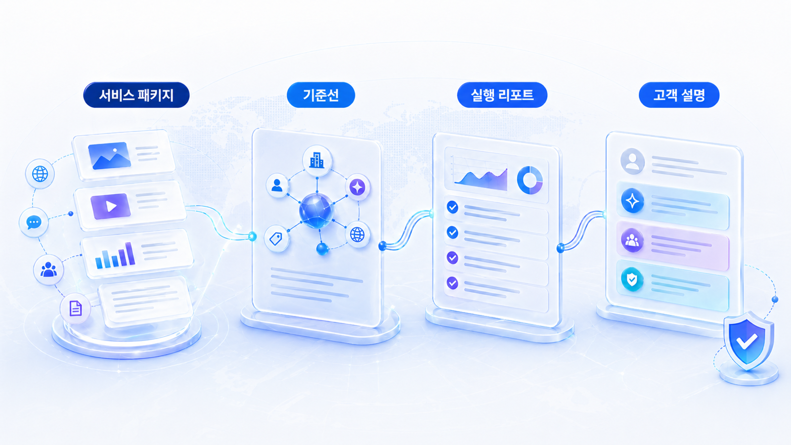
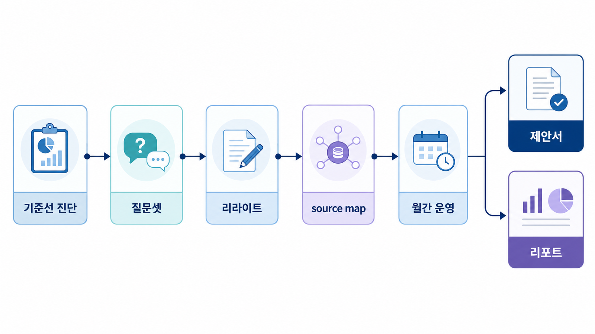

## PR/마케팅 에이전시 GEO 서비스 설계



PR 에이전시가 GEO를 서비스로 만들 때 가장 어려운 점은 “AI 검색에 노출되게 해드립니다”를 실행 가능한 범위로 바꾸는 일입니다.

좋은 서비스는 질문셋, 기준선, 답변 근거, 콘텐츠 수정, 외부 source, 월간 리포트를 나눠 설명합니다. 그래야 고객도 기대치를 이해하고, 팀도 반복 운영할 수 있습니다.

[TOC]

## 서비스 패키지 기준

| 기준 | 읽는 법 |
|---|---|
| 진단 | 현재 mention/source/citation을 질문군별로 보여준다 |
| 실행 | 보도자료/뉴스룸/외부 출처/콘텐츠 수정 범위를 나눈다 |
| 반복 | 월간 리포트와 재측정 질문을 계약 범위에 넣는다 |

## 사례 적용 흐름

1. 고객 업종의 대표 질문을 정한다
2. 현재 AI 답변과 경쟁 브랜드를 기록한다
3. 뉴스룸/보도자료/외부 source 중 약한 층을 찾는다
4. 제안서에 할 일과 하지 않을 일을 분리한다
5. 30일 리포트로 변화 이유를 설명한다



*PR 에이전시 GEO 서비스 패키지 맵*

## 서비스화 예시

AcmePR은 “B2B SaaS 보안 솔루션 추천” 질문에서 고객사가 빠지는 이유를 리포트로 보여줍니다. 단순 기사 배포가 아니라 비교 기준, 뉴스룸 설명, 외부 source 후보를 묶어 30일 실행 범위로 제안합니다.

## 정리 양식

```text
고객 업종:
대표 질문군:
현재 기준선:
약한 source:
제안 범위:
다음 리포트 날짜:
```

## 다음 흐름

캠페인 URL 사례는 [캠페인 URL 인용 추적](https://wikidocs.net/346619)에서 이어집니다.
