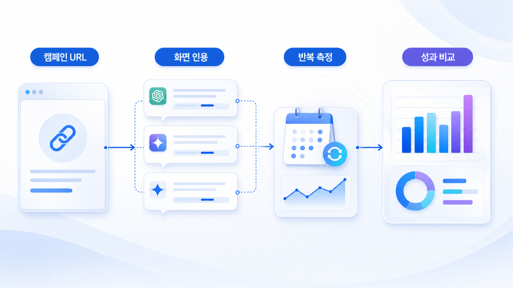
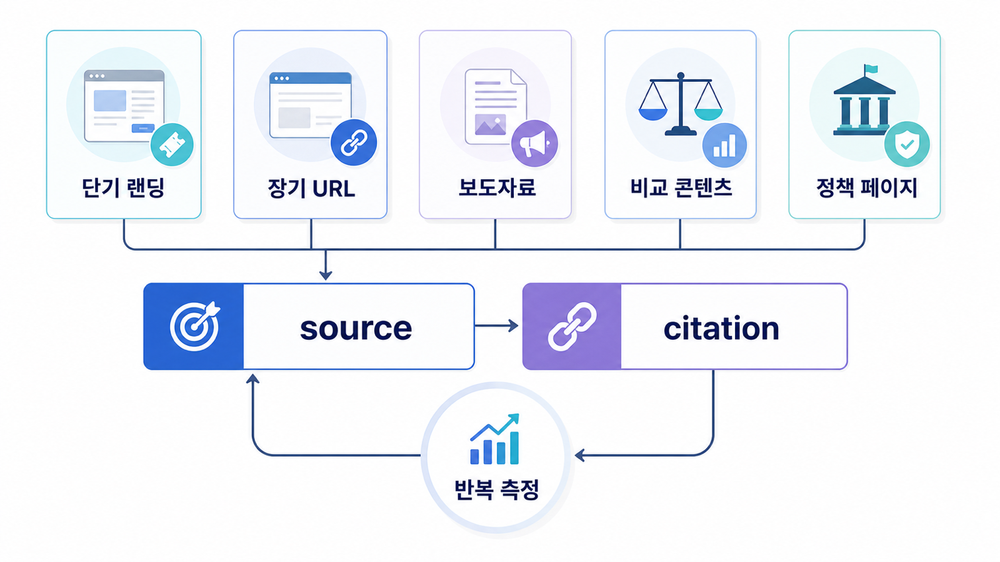

## 캠페인 URL citation 추적: 일회성 언급과 반복 인용



캠페인 GEO의 핵심은 일시적인 노출을 성과로 착각하지 않는 것입니다. 이벤트 페이지가 한 번 언급되었는지, 특정 질문에서 반복 citation 되는지, 캠페인 종료 뒤에도 오래된 정보가 남는지까지 봐야 합니다.

가상 기업 AcmeCampaign은 6주짜리 B2B 리포트 캠페인을 운영합니다. 목표는 리포트 다운로드가 아니라 “AI search report template”, “GEO benchmark for SaaS” 같은 질문에서 캠페인 URL이 근거로 잡히는지 확인하는 것입니다.

[TOC]

## 기준선 진단

| 항목 | 현재 상태 | 문제 |
|---|---|---|
| 캠페인 URL | 랜딩 페이지 1개 | 종료 후 유지 계획 없음 |
| 질문셋 | 브랜드명 중심 | 비브랜드 리포트 질문 부족 |
| source | 보도자료/블로그 | 공식 리포트 본문 citation 약함 |
| citation | 일부 AI 답변에서 블로그 인용 | 랜딩 URL 직접 인용 적음 |
| 리스크 | 날짜/수치 업데이트 불명확 | 종료 후 오래된 수치 인용 가능 |

## 왜 캠페인 URL은 사라지는가

캠페인 페이지는 보통 짧은 문구, 다운로드 폼, 광고 카피 중심으로 만들어집니다. AI 답변이 인용하기에는 데이터 정의, 방법론, 표, FAQ, 업데이트 날짜가 부족합니다. 그래서 AI는 캠페인 URL보다 보도자료나 외부 요약 글을 인용합니다.



*캠페인 URL은 공개 전, 운영 중, 종료 후 상태를 나눠 citation 유지와 오래된 정보 리스크를 함께 관리해야 한다.*

## 4주 실행 흐름

| 주차 | 실행 | 측정 |
|---|---|---|
| 1주차 | 캠페인 질문셋/기준선 측정 | mention/source/citation |
| 2주차 | 랜딩에 방법론, 표, FAQ, 업데이트 날짜 추가 | 공식 URL citation |
| 3주차 | PR, 뉴스룸, 외부 요약 글을 같은 메시지로 정렬 | source 다양성 |
| 4주차 | 종료 후 안내와 evergreen URL 정리 | 오래된 정보 오류 |

## 바로 써보는 질문셋

- 이 브랜드/상품/캠페인이 어떤 질문에서 언급되어야 하는가?
- 현재 AI 답변은 어떤 source를 반복해서 근거로 쓰는가?
- 공식 URL이 citation으로 잡히는가, 외부 글만 잡히는가?
- 오래된 정보나 위험 표현이 답변에 남아 있는가?
- 이번 달에 고칠 URL, 외부 출처, 기술 이슈는 무엇인가?

## 담당자별 실행 티켓

| 담당 | 실행 티켓 |
|---|---|
| 콘텐츠 | 첫 문단, FAQ, 비교표, 업데이트 날짜 보강 |
| 기술 | canonical, sitemap, robots, schema 점검 |
| PR/브랜드 | 외부 설명 문장, 디렉터리, 보도자료 정렬 |
| 운영 | 같은 질문셋으로 재측정하고 리포트에 변화 기록 |

## 미니 리포트 예시

```text
질문: GEO benchmark for SaaS teams
이전 답변: 경쟁사 블로그 2건 인용, AcmeCampaign 미언급
수정: 캠페인 랜딩에 방법론/표/FAQ/업데이트 날짜 추가
재측정: mention 0→3/10, 공식 랜딩 citation 0→2/10
다음 액션: 리포트 요약 페이지를 evergreen URL로 분리
```

## 다음 흐름

캠페인 URL을 관리했다면 상시 자산인 뉴스룸을 엔티티 허브로 설계하는 사례를 봅니다. 이어서 [엔터프라이즈 뉴스룸을 엔티티 허브로 설계하기](https://wikidocs.net/346620)를 봅니다.
