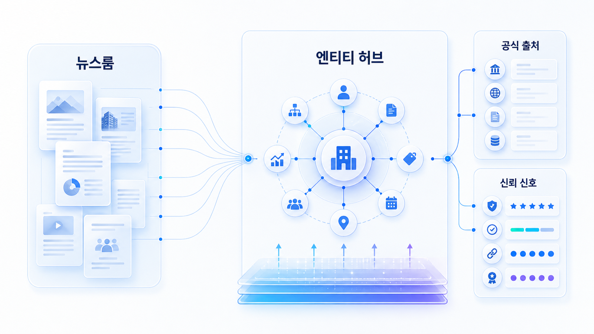
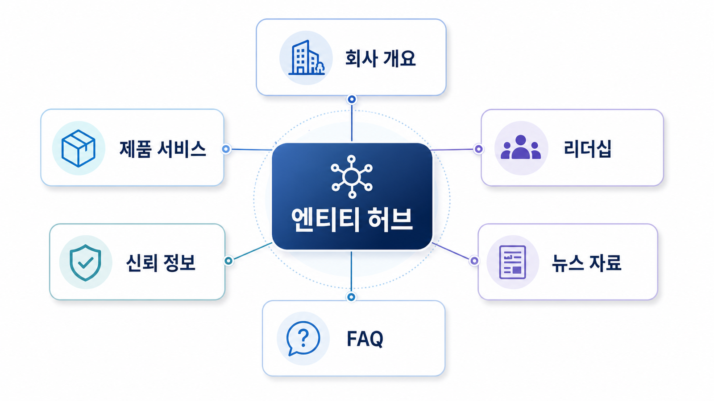

## 엔터프라이즈 뉴스룸을 엔티티 허브로 설계하기



뉴스룸은 보도자료를 모아두는 곳이 아닙니다. GEO 관점에서는 회사명, 제품명, 대표, 투자, 고객 사례, 기술 용어, 공식 수치를 일관되게 설명하는 엔티티 허브입니다.

AcmeNewsroom은 언론 보도는 많지만 AI 답변에서 회사 설명이 매번 다르게 나옵니다. 원인은 공식 뉴스룸보다 오래된 기사와 외부 프로필이 더 자주 인용되기 때문입니다.

[TOC]

## 기준선 진단

| 항목 | 현재 상태 | 문제 |
|---|---|---|
| 회사 설명 | 기사마다 다름 | 핵심 카테고리 불일치 |
| 제품 설명 | 기능명 중심 | 고객 문제와 사용 장면 약함 |
| 뉴스룸 URL | 보도자료 목록 | 엔티티 요약 페이지 없음 |
| 외부 프로필 | 일부 오래됨 | 대표/주소/카테고리 불일치 |
| citation | 과거 투자 기사 반복 | 최신 제품/고객 사례 약함 |

## 뉴스룸의 역할을 다시 잡는다

뉴스룸은 “우리 소식”보다 “AI와 기자, 고객이 인용할 공식 설명”을 담아야 합니다. 회사 개요, 제품 카테고리, 주요 수치, 대표 인용문, 고객 사례, 미디어 키트, 업데이트 날짜를 분리해 둡니다.



*뉴스룸은 PR 저장소가 아니라 공식 엔티티 설명, 제품 맥락, 외부 출처를 연결하는 허브다.*

## 4주 실행 흐름

| 주차 | 실행 | 확인할 지표 |
|---|---|---|
| 1주차 | 브랜드/제품/대표 질문셋 측정 | 설명 불일치, citation URL |
| 2주차 | 회사 개요/제품 개요/미디어 키트 정리 | 공식 URL 인용 가능성 |
| 3주차 | 오래된 외부 프로필 수정 요청 | source 정합성 |
| 4주차 | 같은 질문 재측정과 PR 가이드 반영 | 오해 표현 감소 |

## 미니 리포트 예시

```text
질문: What is AcmeNewsroom known for?
오류: 2022년 투자 기사 기준으로 회사 설명
원인: 공식 뉴스룸에 최신 카테고리 요약 URL 없음
수정: company overview, product overview, media kit 추가
재측정: 오래된 기사 citation 5건→2건, 공식 뉴스룸 citation 0건→3건
```

## 다음 흐름

뉴스룸이 브랜드 엔티티 허브라면, 로컬 서비스는 지도와 방문 전환이 핵심입니다. 이어서 [로컬/전문 서비스 GEO](https://wikidocs.net/346621)를 봅니다.
