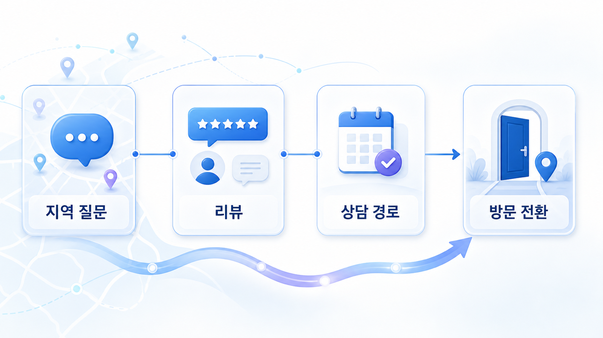
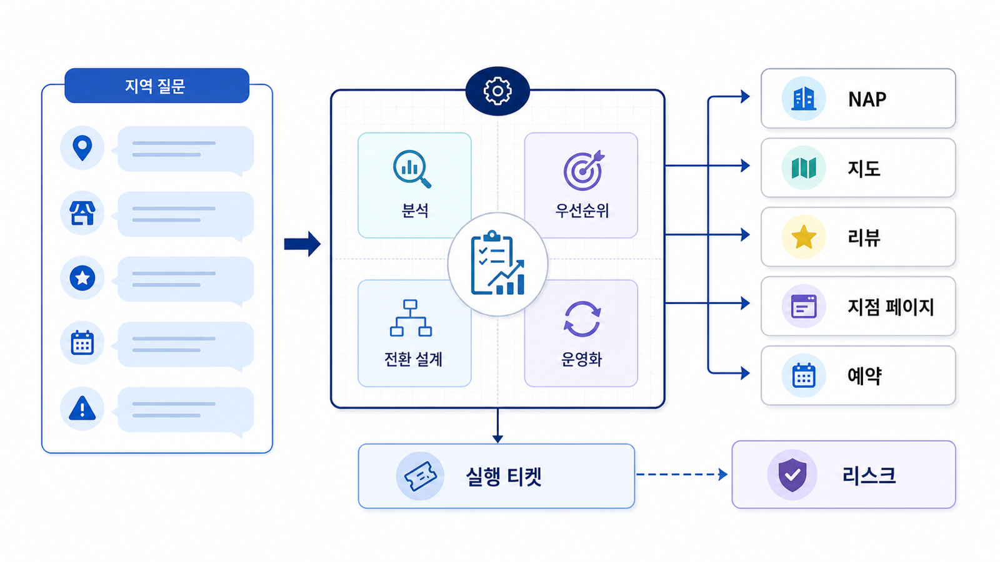

## 로컬/전문 서비스 GEO: 지역 질문과 방문 전환



로컬/전문 서비스 GEO는 “근처 추천” 질문에서 이름이 나오는 것만으로 끝나지 않습니다. 지도 프로필, 리뷰, 지점 페이지, 예약/전화/길찾기, 전문 표현 리스크가 함께 맞아야 방문 전환으로 이어집니다.

가상 기업 AcmeClinic은 지도 노출은 어느 정도 있지만 AI 답변에서 토요일 진료, 주차, 상담 가능 여부가 불명확하게 설명됩니다.

[TOC]

## 기준선 진단

| 항목 | 현재 상태 | 문제 |
|---|---|---|
| NAP | 지도/사이트 일부 불일치 | 지점 식별 혼선 |
| 질문셋 | 지역명+업종 중심 | 방문 조건 질문 부족 |
| 리뷰 | 별점은 높음 | 최신 방문 맥락 약함 |
| 지점 페이지 | 소개 중심 | 예약/주차/준비 FAQ 부족 |
| 리스크 | 후기 표현 일부 과장 | 의료/전문 표현 검토 필요 |

## 로컬 서비스에 적용할 점검 순서

이 사례는 12장의 운영 흐름을 그대로 적용합니다. NAP로 로컬 엔티티를 맞추고, 지도 프로필과 공식 지점 페이지를 연결한 뒤, 리뷰 맥락과 방문 전환 질문을 정리합니다. 병원/전문 업종은 의료광고와 후기 표현 리스크를 별도 질문셋으로 측정합니다.



*로컬 GEO는 지도 후보, AI 답변 후보, 방문 전환 정보를 한 보드에서 같이 봐야 한다.*

## 4주 실행 흐름

| 주차 | 실행 | 확인할 지표 |
|---|---|---|
| 1주차 | 지역/방문 조건 질문셋 측정 | mention/source/citation |
| 2주차 | NAP, 지도 프로필, 지점 URL 정리 | 정보 불일치 감소 |
| 3주차 | 예약/주차/대기/준비 FAQ 보강 | 공식 URL citation |
| 4주차 | 위험 표현과 방문 전환 재측정 | 오류/과장 표현 감소 |

## 바로 써보는 질문셋

- 이 브랜드/상품/캠페인이 어떤 질문에서 언급되어야 하는가?
- 현재 AI 답변은 어떤 source를 반복해서 근거로 쓰는가?
- 공식 URL이 citation으로 잡히는가, 외부 글만 잡히는가?
- 오래된 정보나 위험 표현이 답변에 남아 있는가?
- 이번 달에 고칠 URL, 외부 출처, 기술 이슈는 무엇인가?

## 담당자별 실행 티켓

| 담당 | 실행 티켓 |
|---|---|
| 콘텐츠 | 첫 문단, FAQ, 비교표, 업데이트 날짜 보강 |
| 기술 | canonical, sitemap, robots, schema 점검 |
| PR/브랜드 | 외부 설명 문장, 디렉터리, 보도자료 정렬 |
| 운영 | 같은 질문셋으로 재측정하고 리포트에 변화 기록 |

## 미니 리포트 예시

```text
질문: 판교 토요일 진료 가능한 피부과
이전 답변: AcmeClinic 미언급, 지도 후기 2건 인용
수정: 토요일 진료/예약/주차 FAQ와 지도 영업시간 일치
재측정: mention 1→5/10, 공식 지점 URL citation 0→3/10
다음 액션: 대기 시간/방문 준비 FAQ 추가
```

## 다음 흐름

로컬보다 규제와 신뢰가 더 강하게 작동하는 업종은 금융 사례로 넘어갑니다. 이어서 [금융/규제 산업 GEO](https://wikidocs.net/346622)를 봅니다.
