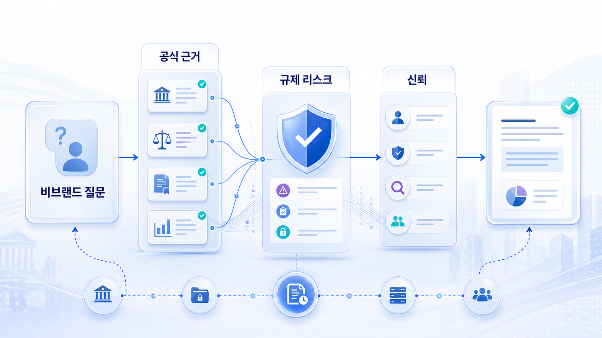
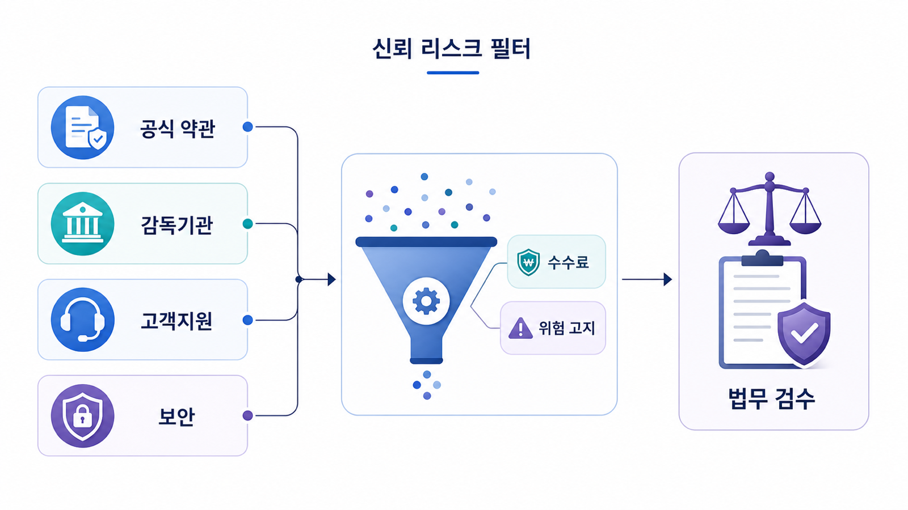

## 금융/규제 산업 GEO: 신뢰/리스크/비브랜드 질문



금융/규제 산업의 GEO는 노출보다 정확성과 위험 표현 관리가 먼저입니다. AI 답변이 브랜드를 추천하더라도 수익 보장, 조건 누락, 오래된 수수료, 잘못된 자격 설명이 섞이면 성과가 아니라 리스크가 됩니다.

가상 기업 AcmeFinance는 비브랜드 질문에서 잘 보이고 싶지만, AI 답변은 오래된 비교 글과 커뮤니티 후기를 인용해 조건을 부정확하게 설명합니다.

`AcmeFinance`라는 이름은 설명을 위한 가상 기업명이며, 실제 고객 사례가 아닙니다.

[TOC]

## 기준선 진단

| 항목 | 현재 상태 | 문제 |
|---|---|---|
| 비브랜드 질문 | 일부 mention 있음 | 추천 이유가 불명확 |
| 공식 URL | 상품 소개 중심 | 조건/제한/업데이트 날짜 약함 |
| 외부 source | 비교 블로그 강함 | 오래된 수수료 정보 반복 |
| 리스크 표현 | “최고”, “보장”류 표현 | 검수 필요 |
| 보고 기준 | 언급률 중심 | 오류/위험 문장 추적 부족 |

## 신뢰와 리스크를 함께 측정한다

금융 GEO 리포트에는 mention만 넣으면 안 됩니다. 질문별로 공식 URL citation, 조건 누락, 오래된 정보, 위험 표현, 수정 담당을 함께 남겨야 합니다. 특히 비브랜드 질문에서는 경쟁사와 함께 비교되는 문맥을 확인합니다.



*금융/규제 산업 GEO는 더 많이 언급되는 것보다 틀리게 언급되지 않는 상태를 먼저 만든다.*

## 4주 실행 흐름

| 주차 | 실행 | 확인할 지표 |
|---|---|---|
| 1주차 | 비브랜드/비교/리스크 질문셋 측정 | 오류 문장, citation URL |
| 2주차 | 공식 조건/제한/FAQ/업데이트 날짜 보강 | 공식 URL citation |
| 3주차 | 외부 비교 글/디렉터리 수정 요청 | 오래된 정보 감소 |
| 4주차 | compliance 검수와 재측정 | 위험 표현 감소 |

## 바로 써보는 질문셋

- 이 브랜드/상품/캠페인이 어떤 질문에서 언급되어야 하는가?
- 현재 AI 답변은 어떤 source를 반복해서 근거로 쓰는가?
- 공식 URL이 citation으로 잡히는가, 외부 글만 잡히는가?
- 오래된 정보나 위험 표현이 답변에 남아 있는가?
- 이번 달에 고칠 URL, 외부 출처, 기술 이슈는 무엇인가?

## 담당자별 실행 티켓

| 담당 | 실행 티켓 |
|---|---|
| 콘텐츠 | 첫 문단, FAQ, 비교표, 업데이트 날짜 보강 |
| 기술 | canonical, sitemap, robots, schema 점검 |
| PR/브랜드 | 외부 설명 문장, 디렉터리, 보도자료 정렬 |
| 운영 | 같은 질문셋으로 재측정하고 리포트에 변화 기록 |

## 미니 리포트 예시

```text
질문: small business expense card with low fees
오류: 2023년 수수료 조건을 현재 조건처럼 설명
반복 citation: 외부 비교 블로그 2개
수정: 공식 pricing/FAQ 업데이트, 비교 글 수정 요청
재측정: 오류 답변 4건→1건, 공식 pricing citation 0건→3건
```

## 다음 흐름

상품 데이터가 AI 구매 판단으로 이어지는 업종은 커머스 사례로 넘어갑니다. 이어서 [커머스/플랫폼 GEO](https://wikidocs.net/346623)를 봅니다.
