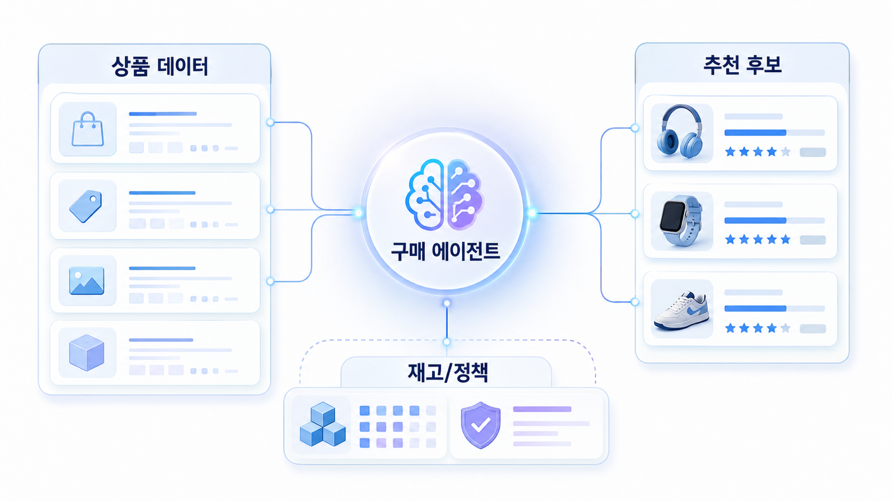

## 커머스/플랫폼 GEO: 상품 데이터와 AI 구매 에이전트 대응



커머스/플랫폼 GEO는 콘텐츠와 데이터가 동시에 맞아야 합니다. AI 구매 에이전트는 상품 상세 문장뿐 아니라 가격, 재고, 리뷰, 옵션, 배송 조건 같은 구조화된 정보를 함께 봅니다.

상품 데이터가 흔들리면 좋은 설명도 추천 후보로 이어지기 어렵습니다. 이 사례에서는 상품 정보 정합성과 AI 답변의 비교 기준을 하나의 QA 루프로 봅니다.

[TOC]

## 커머스 사례 기준

| 기준 | 읽는 법 |
|---|---|
| 비교 속성 | AI가 반복해서 쓰는 상품 비교 기준을 본다 |
| 정합성 | 상세/schema/feed/review 값이 충돌하지 않는지 본다 |
| 전환 | 추천 답변 뒤에 구매 가능한 경로가 남는지 본다 |

## 사례 적용 흐름

1. 대표 상품군을 고른다
2. 구매 조건형 질문을 만든다
3. AI 답변의 비교 속성과 경쟁 상품을 기록한다
4. 상품 상세/schema/feed/review 충돌을 고친다
5. 2주 뒤 추천 후보와 citation 변화를 다시 본다


*커머스 AI 구매 데이터 QA 루프*

## 커머스 사례 예시

AcmeStore는 “반려동물 털 청소용 무선청소기” 질문에서 흡입력보다 필터, 소음, 배터리, 브러시 구성, 후기 문맥이 반복된다는 점을 발견합니다. 이후 상세 페이지와 feed를 같은 기준으로 맞춰 추천 후보 변화를 봅니다.

## 정리 양식

```text
대표 상품군:
구매 질문:
AI 비교 속성:
데이터 충돌:
수정 위치:
2주 재측정 질문:
```

## 다음 흐름

부록에서는 [HaloX 기능과 분석 프레임](https://wikidocs.net/346530)을 연결해 봅니다.
