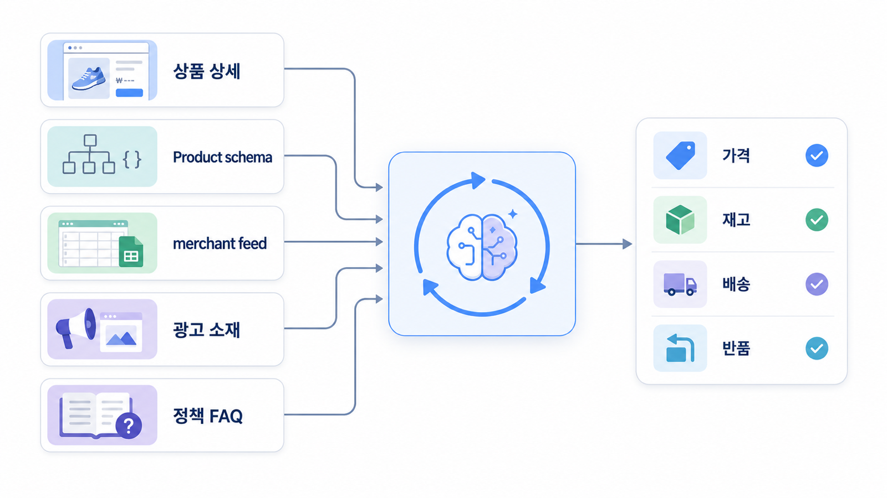

## 커머스/플랫폼 GEO: 상품 데이터와 AI 구매 에이전트 대응


커머스 GEO는 카테고리 글만의 문제가 아닙니다. AI 구매 에이전트가 상품명, 가격, 재고, 배송, 반품, 리뷰, 비교 기준을 읽고 후보를 좁힐 수 있도록 상품 데이터와 피드, schema, 리뷰 맥락을 맞춰야 합니다.

가상 기업 AcmeCommerce는 검색에서는 노출되지만 “재택근무용 조용한 키보드 추천” 같은 조건형 질문에서 AI 답변 후보로 안정적으로 등장하지 않습니다.

[TOC]

## 기준선 진단

| 항목 | 현재 상태 | 문제 |
|---|---|---|
| 상품 데이터 | 상세페이지마다 다름 | 비교 기준 필드 누락 |
| Product schema | 일부 적용 | 가격/재고/리뷰 불일치 |
| merchant feed | 운영 중 | 상세페이지와 값이 다름 |
| 리뷰 | 많음 | 조건형 맥락 분류 안 됨 |
| citation | 카테고리 글 중심 | 상품 URL 직접 인용 약함 |

## 커머스 상품 데이터에 적용할 점검 순서

이 사례는 11장의 커머스 운영 흐름을 적용합니다. 상품 정보 구조화, Product schema, merchant feed, 리뷰 맥락, 카테고리 FAQ를 같은 기준으로 맞춥니다. AI 구매 에이전트는 “좋은 상품”보다 “조건에 맞는 상품”을 찾기 때문에 필드가 명확해야 합니다.



*커머스 GEO는 상품 상세페이지, schema, feed, 리뷰 맥락을 같은 구매 조건으로 정렬하는 데이터 QA 루프다.*

## 4주 실행 흐름

| 주차 | 실행 | 확인할 지표 |
|---|---|---|
| 1주차 | 조건형/비교형 상품 질문셋 측정 | 상품 mention/citation |
| 2주차 | 핵심 상품 필드와 Product schema 정리 | 데이터 불일치 감소 |
| 3주차 | feed, 리뷰, FAQ, 카테고리 페이지 보강 | 조건형 질문 대응 |
| 4주차 | 같은 질문 재측정과 품절/가격 QA | 상품 URL citation |

## 바로 써보는 질문셋

- 이 브랜드/상품/캠페인이 어떤 질문에서 언급되어야 하는가?
- 현재 AI 답변은 어떤 source를 반복해서 근거로 쓰는가?
- 공식 URL이 citation으로 잡히는가, 외부 글만 잡히는가?
- 오래된 정보나 위험 표현이 답변에 남아 있는가?
- 이번 달에 고칠 URL, 외부 출처, 기술 이슈는 무엇인가?

## 담당자별 실행 티켓

| 담당 | 실행 티켓 |
|---|---|
| 콘텐츠 | 첫 문단, FAQ, 비교표, 업데이트 날짜 보강 |
| 기술 | canonical, sitemap, robots, schema 점검 |
| PR/브랜드 | 외부 설명 문장, 디렉터리, 보도자료 정렬 |
| 운영 | 같은 질문셋으로 재측정하고 리포트에 변화 기록 |

## 미니 리포트 예시

```text
질문: quiet keyboard for home office under $100
오류: 품절 상품 추천, 가격 정보 불일치
원인: feed와 상세페이지 가격/재고 차이
수정: feed QA, Product schema, 카테고리 비교표 보강
재측정: 품절 추천 3건→0건, 상품 URL citation 1건→4건
```

## 다음 흐름

케이스북을 다 읽었다면 HaloX 기능 흐름과 GEO 개념이 어떻게 연결되는지 확인합니다. 이어서 [HaloX GEO 솔루션과 브랜드 가시성 분석 맵](https://wikidocs.net/346530)을 봅니다.
