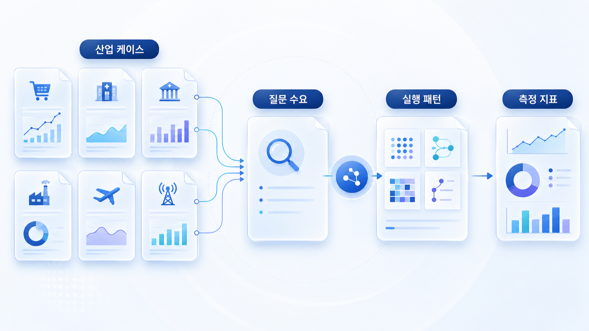

## 산업별 GEO 케이스북

GEO는 개념만으로 이해하기 어렵습니다. 같은 `브랜드 언급률`, `답변 근거(source)`, `화면 인용(citation)`을 보더라도 업종마다 질문의 모양, 필요한 출처, 실행 순서가 달라집니다. 90장은 0~12장에서 배운 SEO/GEO 개념을 실제 산업 상황에 연결하는 실전 케이스북입니다.

이 장의 목표는 “우리도 AI 검색에 잘 나오자”가 아닙니다. SEO 키워드, SERP 의도, AI 질문셋, source/citation 측정, 콘텐츠 구조, 오프사이트 엔티티, 테크니컬 GEO, 산업별 리스크, 실행 리포트까지 하나의 운영 흐름으로 연결하는 것입니다.

[TOC]

## 90장을 읽기 전에 가져와야 할 입력값

90장은 앞 장을 읽은 뒤 바로 실행할 수 있게 설계합니다. 각 케이스를 보기 전에 아래 입력값을 준비하면 좋습니다.

| 앞 장 | 가져올 입력값 | 90장에서 쓰는 방식 |
|---|---|---|
| 00장 | GEO/SEO/AEO/AIO 차이, 업무 적용 흐름 | 케이스의 목표를 노출/인용/전환/리스크 중 어디에 둘지 결정 |
| 01장 | SEO 키워드, 검색 의도, SERP 분석, 온페이지/내부 링크/테크니컬 SEO | 산업별 질문셋의 seed keyword와 콘텐츠 갭 도출 |
| 02장 | mention/source/citation 측정 방식 | 케이스별 기준선 리포트 작성 |
| 03장 | Query Fan-out 질문 확장 | 사용자 질문을 비교/리스크/전환/정책 질문으로 확장 |
| 04장 | Answer-first 콘텐츠, FAQ, schema, 표 구조 | AI가 읽기 쉬운 페이지 리라이트 |
| 05장 | 엔티티, 오프사이트 source map, PR/커뮤니티/외부 블로그 | 산업별 신뢰 근거 설계 |
| 06장 | SSR/CSR, robots, sitemap, schema, canonical, meta | 기술적으로 읽히는 상태 검증 |
| 07장 | 산업별 차이 | 케이스 유형 선택 |
| 08장 | 글로벌/영문 GEO | 글로벌 브랜드/다국어 케이스 확장 |
| 09장 | 리포트/도구/제안서 판단 | 월간 리포트와 비용/범위 판단 |
| 10장 | 4주 실행 로드맵 | 케이스를 30일 액션 플랜으로 변환 |
| 11장 | 커머스/AI 구매 에이전트 | 상품 데이터/피드/정책 케이스에 적용 |
| 12장 | 로컬 SEO/GEO, NAP, 지도, 리뷰, 의료광고 | 오프라인/병원/지점형 케이스에 적용 |

## 이 장의 케이스 구조

각 케이스는 같은 틀로 읽습니다.

| 구간 | 읽을 내용 | 산출물 |
|---|---|---|
| 상황 | 업종에서 실제로 자주 생기는 문제 | 문제 정의 |
| 기준선 | SEO/GEO 측정 전 현재 상태 | baseline log |
| 실패 패턴 | 빈약한 실행이 왜 성과로 이어지지 않는지 | 원인 가설 |
| 0~12장 연결 | 어떤 장의 개념을 가져와야 하는지 | 실행 지도 |
| 4주 실행 | 무엇을 어떤 순서로 고칠지 | 운영 플랜 |
| 측정표 | mention/source/citation/전환/리스크를 어떻게 기록할지 | 리포트 템플릿 |
| Before/After | 나쁜 산출물과 좋은 산출물 차이 | 품질 기준 |

## 케이스북 공통 예시 브랜드

실제 브랜드를 특정하지 않기 위해 가상의 예시를 사용합니다. 중요한 것은 이름이 아니라 문제 유형입니다.

| 예시명 | 업종 | 핵심 문제 |
|---|---|---|
| AcmePR | PR/마케팅 에이전시 | GEO를 서비스로 팔아야 하지만 SEO/PR/콘텐츠와 차이를 설명하지 못함 |
| AcmeCampaign | 캠페인/브랜드 마케팅 | 캠페인 URL이 한 번 인용됐는지 반복 근거가 됐는지 구분하지 못함 |
| AcmeNewsroom | 엔터프라이즈 뉴스룸 | 콘텐츠는 많지만 브랜드 엔티티 설명이 흩어짐 |
| AcmeClinic | 로컬/전문 서비스 | 지도/리뷰/지점 페이지/방문 전환 정보가 연결되지 않음 |
| AcmeFinance | 금융/규제 산업 | 신뢰와 리스크 질문을 함께 관리하지 못함 |
| AcmeCommerce | 커머스/플랫폼 | 상품 데이터와 feed/schema/정책 정보가 충돌함 |

## 공통 기준선 리포트

모든 케이스는 아래 표에서 시작합니다. 이 표가 있어야 “콘텐츠를 더 쓰자”가 아니라 “무엇이 막혀서 AI 답변에 못 들어가는가”를 판단할 수 있습니다.

| 질문 | 현재 답변 | 우리 브랜드 언급 | source | citation | 오류/리스크 | 원인 가설 | 다음 액션 |
|---|---|---|---|---|---|---|---|
| 대표 비브랜드 질문 | 경쟁사 중심 | 없음 | 외부 블로그/언론 | 경쟁사 URL | 우리 공식 근거 없음 | 카테고리 페이지 부족 | Answer-first 페이지 작성 |
| 비교 질문 | 일반론 | 약함 | 리뷰/커뮤니티 | 없음 | 장단점 부정확 | 비교 기준 없음 | FAQ/표/외부 source map 보강 |
| 전환 질문 | 행동 정보 누락 | 있음 | 홈페이지 | 공식 URL | 가격/예약 정보 오래됨 | 운영 정보 불일치 | NAP/CTA/정책 업데이트 |
| 리스크 질문 | 과장 표현 섞임 | 있음 | 오래된 기사 | 기사 URL | 규제 표현 위험 | 외부 출처 정리 안 됨 | 위험 문구 수정 요청 |

## 90장을 4주 프로젝트로 쓰는 법

| 주차 | 해야 할 일 | 사용할 장 | 결과물 |
|---|---|---|---|
| 1주차 | SEO 키워드/SERP/AI 질문 기준선 측정 | 01/02/03장 | 기준선 리포트, 질문셋 30개 |
| 2주차 | 콘텐츠 구조와 기술 상태 수정 | 04/06장 | 리라이트 페이지, schema/robots/sitemap 점검표 |
| 3주차 | 오프사이트 source와 엔티티 신호 보강 | 05/07/08장 | source map, PR/커뮤니티/디렉터리 실행표 |
| 4주차 | 산업별 리스크/전환/리포트 정리 | 09/10/11/12장 | 월간 리포트, 다음 30일 티켓 |

## 케이스를 자기 브랜드에 적용하는 순서

1. 자기 업종과 가장 가까운 케이스를 하나 고릅니다.
2. 01장의 방식으로 seed keyword와 SERP 의도를 정리합니다.
3. 03장의 방식으로 질문을 정보형/비교형/전환형/리스크형으로 확장합니다.
4. 02장의 방식으로 AI 답변 기준선을 측정합니다.
5. 04~06장의 방식으로 콘텐츠/출처/기술 문제를 분리합니다.
6. 09~10장의 방식으로 월간 리포트와 실행 티켓을 만듭니다.
7. 커머스는 11장, 로컬/병원은 12장의 전환/리스크 기준을 추가합니다.

## 케이스북의 품질 기준

좋은 케이스는 멋진 성공담이 아니라 재현 가능한 판단 기준을 남깁니다.

| 빈약한 케이스 | 좋은 케이스 |
|---|---|
| AI 검색에 잘 나오게 콘텐츠를 만들었다 | 어떤 질문에서 어떤 source/citation이 바뀌었는지 기록했다 |
| 브랜드 언급이 늘었다 | mention/source/citation/전환/리스크를 분리했다 |
| 블로그를 더 썼다 | SERP 의도와 fan-out 질문에 맞춰 페이지 유형을 나눴다 |
| 언론 보도를 냈다 | 보도자료가 엔티티 설명과 외부 source map에서 어떤 역할인지 정했다 |
| 리뷰를 늘렸다 | 리뷰의 최근성/분포/맥락/답변 리스크를 함께 관리했다 |

## 케이스북 공통 워크시트

아래 워크시트는 모든 산업 케이스에 그대로 적용할 수 있습니다. 중요한 것은 한 번에 완벽한 답을 얻는 것이 아니라, 같은 조건으로 반복 측정하고 실행 티켓으로 바꾸는 것입니다.

| 입력 | 작성 예시 | 다음 단계 |
|---|---|---|
| seed keyword | `고객지원 툴`, `강남 피부과`, `ETF 수수료`, `무선 키보드 추천` | 01장 방식으로 SERP 의도 확인 |
| 사용자 질문 | `50명 스타트업이 쓰기 좋은 고객지원 툴은?` | 03장 방식으로 Fan-out |
| 현재 AI 답변 | 경쟁사 3곳, 우리 브랜드 없음 | 02장 방식으로 mention 기록 |
| 답변 근거 | 비교 블로그, 오래된 기사 | 05장 방식으로 source map |
| 화면 인용 | 경쟁사 카테고리 페이지 | 04/06장 방식으로 우리 페이지 구조 점검 |
| 실행 티켓 | 카테고리 페이지 리라이트, FAQ 추가, 외부 기고 | 10장 방식으로 담당/마감 부여 |

## 실증적으로 보이게 만드는 증거의 종류

케이스북에서 말하는 실증은 “성공했다”는 주장보다 “측정했고, 원인을 나눴고, 다음 실행으로 바꿨다”는 기록입니다.

| 증거 | 약한 형태 | 좋은 형태 |
|---|---|---|
| AI 답변 캡처 | 답변 이미지 1장 | 날짜/플랫폼/질문/조건/source/citation이 있는 로그 |
| SEO 데이터 | 검색량 숫자 | 검색 의도, SERP 유형, 경쟁 페이지, 콘텐츠 갭 |
| 콘텐츠 개선 | 새 글 발행 | Before/After 구조, FAQ, 표, schema 적용 여부 |
| 외부 근거 | 기사 링크 목록 | 어떤 질문의 source가 되기 위한 출처인지 역할 표시 |
| 성과 보고 | 언급됨/안 됨 | mention/source/citation/전환/리스크를 분리한 추세 |

## 30분 실습

1. 우리 업종의 대표 비브랜드 질문 5개를 적습니다.
2. 같은 질문을 ChatGPT, Perplexity, Google AI 환경에서 확인합니다.
3. 답변에 나온 브랜드, source, citation, 오류를 표에 적습니다.
4. 우리 브랜드가 빠진 이유를 `콘텐츠`, `출처`, `기술`, `리스크`, `전환 정보` 중 하나로 분류합니다.
5. 다음 7일 안에 할 수 있는 티켓 3개만 정합니다.

## 하비/방울이/뽀동이식 운영 예시

실무에서는 역할을 나누면 속도가 빨라집니다. 방울이가 질문과 source 후보를 확장조사하고, 뽀동이가 케이스 구조와 리포트 문장을 정리하고, 하비가 최종 우선순위와 실행 범위를 통합하는 방식입니다. 하망이는 필요한 경우 케이스를 설명하는 이미지/다이어그램 방향을 잡는 역할로 붙일 수 있습니다.

## 발행 전 자기 점검 체크리스트

90장의 각 케이스를 자기 브랜드에 적용했다면 마지막으로 아래 질문에 답해야 합니다.

| 점검 질문 | 통과 기준 |
|---|---|
| 이 케이스가 0~12장 중 어떤 개념을 실제로 사용했는가? | 연결 장과 입력값이 표로 보인다 |
| SEO 키워드가 AI 질문셋으로 바뀌었는가? | seed keyword → 질문군 → 실행 티켓 흐름이 있다 |
| AI 답변 측정 조건이 남아 있는가? | 날짜/플랫폼/질문/source/citation이 기록되어 있다 |
| 콘텐츠 문제와 출처 문제와 기술 문제를 분리했는가? | 한 가지 처방으로 몰지 않고 원인 가설이 나뉜다 |
| 산업별 리스크가 반영됐는가? | 금융/의료/커머스/로컬 등 업종별 주의점이 보인다 |
| 다음 행동이 구체적인가? | 담당/마감/완료 기준이 있는 실행 티켓이 있다 |

이 체크리스트를 통과하지 못하면 케이스는 아직 읽을거리에 가깝습니다. 통과하면 실무자가 바로 가져가 실행할 수 있는 워크북에 가까워집니다.

## 다음 흐름

먼저 [90-01 PR/마케팅 에이전시 케이스](https://wikidocs.net/346617)에서 GEO를 설명 가능한 서비스로 만드는 법을 봅니다. 그다음 캠페인 URL, 뉴스룸, 로컬/전문 서비스, 금융/규제 산업, 커머스/플랫폼 순서로 읽으면 0~12장의 개념이 실제 운영 사례로 어떻게 바뀌는지 확인할 수 있습니다.
