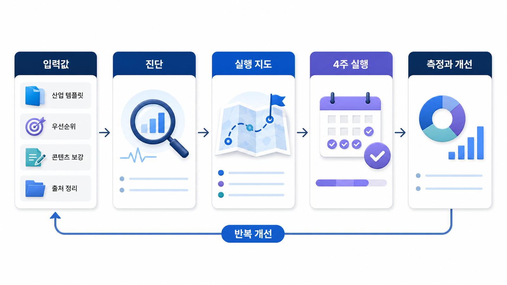

## 산업별 GEO 케이스북


이 케이스북은 00~12장에서 배운 GEO 원칙을 업종별 실행 상황으로 옮기는 장입니다. 같은 mention/source/citation 지표라도 PR 에이전시, 캠페인, 뉴스룸, 로컬 서비스, 금융, 커머스에서는 질문셋과 리스크가 달라집니다.

각 사례는 실제 고객명이 아니라 익명화된 운영 패턴입니다. 중요한 것은 “AI 답변에 이름이 나왔는가”가 아니라 어떤 질문에서, 어떤 근거로, 어떤 표현으로 등장했고, 다음 실행 티켓이 무엇인지입니다.

[TOC]

## 케이스북을 읽는 기준

| 상황 | 먼저 볼 사례 | 같이 볼 장 |
|---|---|---|
| GEO를 서비스로 제안해야 함 | 90-01 | 09장/10장 |
| 캠페인 URL을 추적해야 함 | 90-02 | 02장/05장 |
| 뉴스룸을 엔티티 허브로 만들고 싶음 | 90-03 | 05장/06장 |
| 병원/로컬 서비스 전환을 봐야 함 | 90-04 | 12장 |
| 금융/규제 업종 리스크가 큼 | 90-05 | 05장/09장 |
| 커머스와 AI 구매 에이전트가 중요함 | 90-06 | 11장 |

## 사례는 네 줄로 압축한다

업종별 사례는 긴 성공담보다 아래 네 줄을 먼저 남겨야 합니다.

```text
질문셋: 어떤 질문에서 측정했는가
근거: 어떤 source/citation이 반복되는가
오류: 어떤 누락/왜곡/위험 표현이 있는가
다음 액션: 콘텐츠/source/기술/운영 중 무엇을 고칠 것인가
```



*케이스북은 업종별 성공담이 아니라 질문셋, 근거, 오류, 다음 액션을 반복하는 실행 지도다.*

## 4주 적용 흐름

1주차에는 업종별 대표 질문 20개를 정하고 기준선을 측정합니다. 2주차에는 source/citation과 공식 URL의 간극을 찾습니다. 3주차에는 콘텐츠, 외부 출처, 기술 티켓을 실행합니다. 4주차에는 같은 질문으로 재측정하고 리포트를 남깁니다.

## 정리 양식

```text
업종/브랜드:
대표 질문군:
현재 mention/source/citation:
반복 오류:
가장 강한 외부 출처:
가장 약한 공식 URL:
이번 달 실행 티켓:
다음 달 재측정 기준:
```

## 다음 흐름

첫 사례는 [PR/마케팅 에이전시 GEO 서비스 설계](https://wikidocs.net/346618)입니다.
