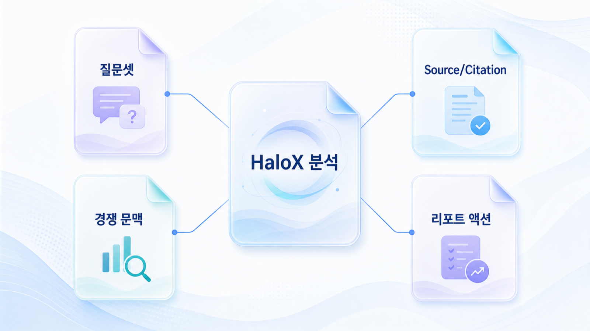
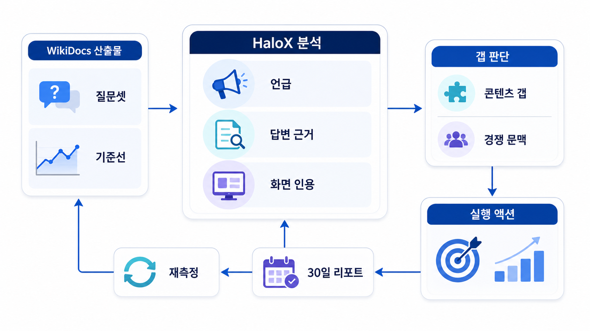

## 부록: HaloX GEO 솔루션과 브랜드 가시성 분석 맵



이 부록은 앞 장의 GEO 개념을 HaloX의 브랜드 가시성 분석 흐름과 연결해 읽는 지도입니다. 제품 소개보다 “어떤 판단을 어떤 데이터로 확인할 것인가”에 초점을 둡니다.

GEO 실행에서 필요한 질문은 늘 비슷합니다. 우리 브랜드가 언급되는가, 어떤 source가 붙는가, 화면 citation이 안정적인가, 경쟁사는 왜 함께 등장하는가, 다음 액션은 무엇인가를 순서대로 봅니다.

[TOC]

## 기능 연결 기준

| 기준 | 읽는 법 |
|---|---|
| 질문셋 | 키워드를 AI 질문 묶음으로 바꾸는 기준을 잡는다 |
| 답변 분석 | mention/source/citation과 경쟁 문맥을 분리한다 |
| 실행 | 콘텐츠/source/기술/리포트 중 다음 액션을 고른다 |

## 읽는 흐름

1. 브랜드나 업종의 대표 질문셋을 만든다
2. AI 답변에서 mention/source/citation을 나눠 본다
3. 반복 경쟁 URL과 빠진 근거를 표시한다
4. 콘텐츠, 외부 source, 기술 이슈 중 원인을 나눈다
5. 30일 리포트로 변화 이유와 다음 액션을 남긴다



*HaloX GEO 기능과 실행 판단 연결 흐름*

## 분석 연결 예시

AcmeGEO가 “AI 검색 최적화 도구 추천” 질문에서 mention은 있지만 citation이 없다면, 문제는 브랜드 인지도보다 근거 URL 부족일 수 있습니다. 이때는 새 글을 쓰기보다 비교 페이지, 리포트 예시, 외부 source 후보를 먼저 점검합니다.

## HaloX 기능을 판단 흐름으로 읽기

HaloX를 기능 목록으로만 보면 이 부록의 의미가 약해집니다. 중요한 것은 화면 이름이 아니라 각 화면이 어떤 결정을 돕는지입니다. 대시보드는 현재 상태를 요약하고, 프롬프트 분석은 질문별 원인을 찾고, 인용 추적은 source/citation을 분리하고, 사이트 진단은 기술/구조 문제를 티켓으로 바꾸며, 전략맵과 콘텐츠 제작은 실행으로 이어집니다.

| HaloX 화면 | 판단 질문 | 연결되는 실행 |
|---|---|---|
| 대시보드 | 이번 주 무엇이 달라졌는가 | 우선 질문군 선정 |
| 프롬프트 분석 | 어떤 질문에서 왜 빠졌는가 | 질문셋/콘텐츠 갭 정리 |
| 인용 추적 | 어떤 URL이 근거/인용으로 반복되는가 | 공식 URL/source 보강 |
| 사이트 진단 | AI와 검색엔진이 읽기 어려운 조건은 무엇인가 | 기술 수정 티켓 |
| 전략맵/콘텐츠 제작 | 무엇을 먼저 만들거나 고칠 것인가 | 콘텐츠 브리프/리라이트 |
| 주간 리포트/내보내기 | 고객과 실행팀에 무엇을 공유할 것인가 | 보고/재측정 루프 |

## 보고서에 남길 문장

```text
HaloX 분석은 점수표가 아니라 질문셋에서 실행 티켓까지 이어지는 운영 흐름입니다. 각 화면의 결과를 mention/source/citation, 사이트 이슈, 콘텐츠 액션, 재측정 조건으로 나눠 읽습니다.
```

## 정리 양식

```text
대표 질문셋:
현재 mention:
현재 source:
현재 citation:
반복 경쟁 URL:
다음 액션:
```

## 다음 흐름

이 부록은 09장 리포트, 10장 4주 로드맵, 90장 케이스북을 실제 분석 흐름으로 다시 연결할 때 활용하면 됩니다.
